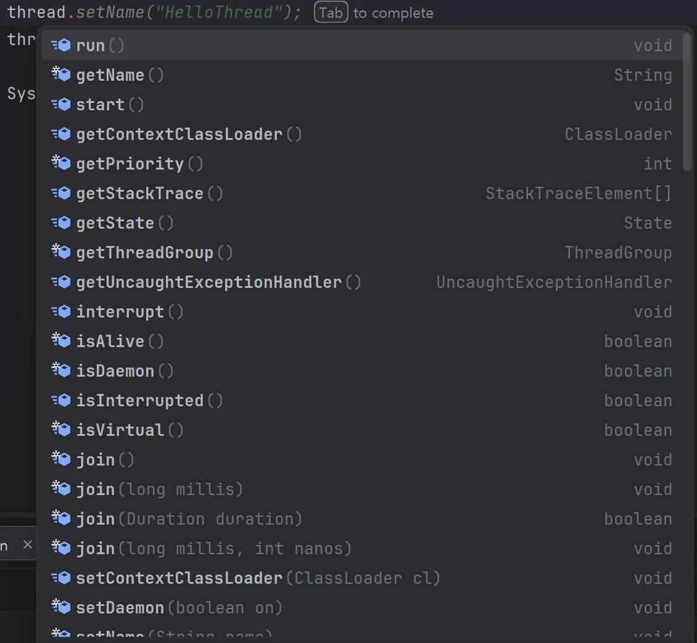
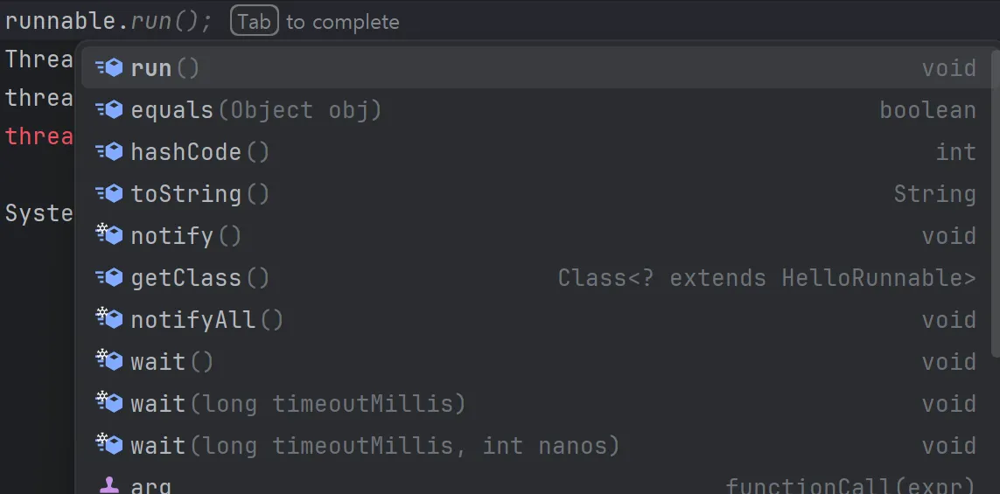

# 스레드 생성 방법

스레드 생성 방법은 두가지이다.
1. Thread를 상속받은 새로운 XXXThread를 만들어 실행하는 것.
2. Runnable를 구현하여, Thread 생성자에 넣어 실행하는 것.

## Thread 상속

```java
public class HelloThread extends Thread{

    @Override
    public void run() {
        System.out.println(Thread.currentThread().getName() + ": run()");
    }
    
}

public class HelloThreadMain {

    public static void main(String[] args) {
        HelloThread helloThread = new HelloThread();
        helloThread.start();
    }

}
```

## Runnable 구현

- 단순한 Runnable 구현과 사용
```java
public class HelloRunnable implements Runnable{
    
    @Override
    public void run() {
        System.out.println(Thread.currentThread().getName() + ": run()");
    }
    
}

public class HelloRunnableMain {

    public static void main(String[] args) {
        HelloRunnable runnable = new HelloRunnable();
        Thread thread = new Thread(runnable);
        thread.start();
    }

}
```

이때 한 곳에서만 사용될 예정이라면, 굳이 Class로 만들 지 않고, 익명객체나 inner class로 만들어서 사용하는 것이 좋을 것이다.

```java
// inner class
public class InnerRunnableMainV1 {

    public static void main(String[] args) {
        log("main() start");

        MyRunnable runnable = new MyRunnable();
        Thread thread = new Thread(runnable);
        thread.start();

        log("main() end");
    }

    static public class MyRunnable implements Runnable{
        @Override
        public void run() {
            log("run()");
        }
    }

}

// 익명 객체
public class InnerRunnableMainV2 {

    public static void main(String[] args) {
        log("main() start");

        Runnable runnable = new Runnable() {
            @Override
            public void run() {
                log("run()");
            }
        };

        Thread thread = new Thread(runnable);
        thread.start();


        log("main() end");
    }

}

```

## 어떤 방법을 선택할까

결론은 Runnable 구현 방법을 사용하자.

내가 느낀 가장 큰 이유는 단일상속 때문이다.
코드를 짜다보면 extends를 사용할 일이 있는데, Thread를 상속받아버리면 더이상 다른 객체를 상속받을 수 없다.
하지만 인터페이스는 다중 상속을 허용하기 때문에, 이를 사용하는 게 좋다고 생각한다.
또한, 스레드와 수행할 작업을 분리한다는 점에서 객체지향적이라고 생각한다. (책임 분리)

물론 스레드를 상속받는 경우, 스레드의 모든 메서드를 사용할 수 있지만, 프로젝트를 할 때, 스레드의 모든 메서드를 사용할 일이 없다.
멀티 스레드를 사용하는 이유는 작업을 효율적으로 처리하기 위해서지, OS적으로 스레드의 기능들을 딥하게 사용하려는 건 아니기 때문이다.

즉, `굳이` Thread를 상속받아 구현할 필요가 없다고 생각한다.

<details>

<summary> 사용 가능한 메서드 비교 </summary>

### Thread 상속



### Runnable 구현



</details>


# 데몬 스레드

데몬 스레드는 백그라운드에서 동작하는 스레드이다.
데몬 스레드는 JVM 종료에 관여하지 않는다.
JVM은 실행할 사용자 스레드가 없는 경우, 프로그램을 종료한다.

Thread의 setDaemon(true)로 설정하고 데몬 스레드에 오래 걸리는 작업을 부여하도라도, 다른 사용자 스레드가 종료되면 사정없이 JVM은 종료된다. 