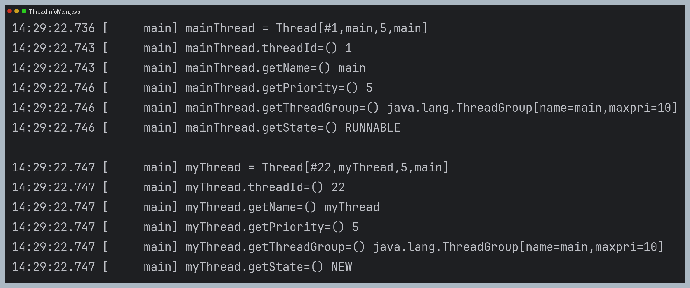

# 스레드 기본 정보

### 스레드 기본 정보 확인을 위한 코드

```java
public class ThreadInfoMain {

    public static void main(String[] args) {
        // main 스레드
        Thread mainThread = Thread.currentThread();
        log("mainThread = " + mainThread);
        log("mainThread.threadId=() " + mainThread.threadId());
        log("mainThread.getName=() " + mainThread.getName());
        log("mainThread.getPriority=() " + mainThread.getPriority());
        log("mainThread.getThreadGroup=() " + mainThread.getThreadGroup());
        log("mainThread.getState=() " + mainThread.getState());
        System.out.println();

        // myThread
        Thread myThread = new Thread(new HelloRunnable(), "myThread");
        log("myThread = " + myThread);
        log("myThread.threadId=() " + myThread.threadId());
        log("myThread.getName=() " + myThread.getName());
        log("myThread.getPriority=() " + myThread.getPriority());
        log("myThread.getThreadGroup=() " + myThread.getThreadGroup());
        log("myThread.getState=() " + myThread.getState());
    }

}
```

### 실행 결과



- Thread.toString(): `스레드ID`, `스레드이름`, `우선순위`, `스레드 그룹`을 출력한다.
- threadId:  고유 식별자이며, JVM에서 유일하다. ID는 개발자가 지정할 수 없다.
- getName(): 스레드 이름은 중복될 수 있다.
- getPriority(): 스레드 우선 순위, 1(가장 낮음)부터 10(가장 높음)으로 설정할 수 있다. 기본 값은 5이다.
- getThreadGroup(): Thread 생성자를 타고 들어가면 부모 스레드의 스레드 그룹을 그대로 사용하는 걸 확인할 수 있다. 스레드 그룹에 관해 직접적으로 잘 사용하진 않는다고 한다.
- getState(): 스레드의 상태를 나타낸다. 
```text
NEW: 스레드가 아직 시작되지 않은 상태이다.
RUNNABLE: 스레드가 실행 중이거나 실행될 준비가 된 상태이다.
BLOCKED: 스레드가 동기화 락을 기다리는 상태이다.
WAITING: 스레드가 다른 스레드의 특정 작업이 완료되기를 기다리는 상태이다.
TIMED_WAITING: 일정 시간 동안 기다리는 상태이다.
TERMINATED: 스레드가 실행을 마친 상태이다.
```
- 실행 중인 main 스레드의 상태는 `RUNNABLE`이고, 생성후 실행되지 않은 myThread는 `NEW`이다.
