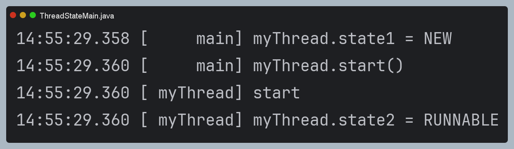
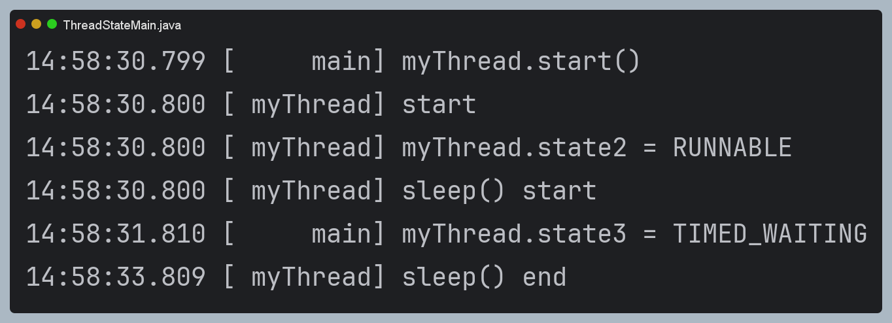
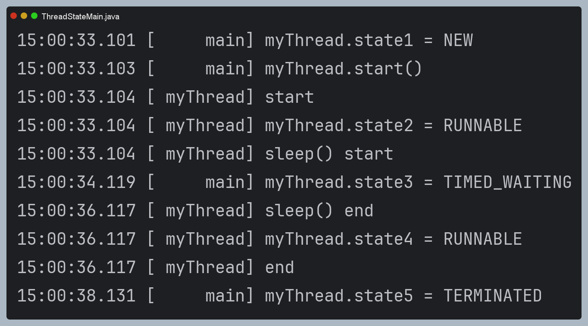

# 스레드 생명 주기

## 스레드의 상태

### 1. New (새로운 상태)
- 스레드가 생성되고 아직 시작되지 않은 상태
- `객체`는 생성했으나 `start()` 메서드를 아직 호출하지 않음.
- `Thread thread = new Thread(runnable);`

### 2. Runnable (실행 `가능` 상태)
- 스레드가 실행될 준비가 된 상태.
- `start()` 호출 시 스레드는 이 상태로 들어간다.
- 정확히는 실행 대기열에 포함되어있는 상태와 CPU에서 실제 실행되고 있는 상태 모두 `RUNNABLE`이다.
- 실행 대기열(실행 스케줄러)과 실제 실행되는 스레드를 구분하는 것이 무의미함. (너무 빠르게 스위칭 되기 때문..)
- 추가로 사람 눈에서는 여러 작업이 실행되고 있는 상태기도 하니까... (1CPU에 게임과 노래 작업을 동시에 실행하는 것처럼)
- 보통은 `실행 상태`라고 부름.

### 3. Blocked (차단 상태)
- CPU의 실행 스케줄에 들어가지 않는다. (따라서 CPU를 사용하지 않는다.)
- 스레드가 다른 스레드에 의해 동기화 락을 얻기 위해 기다리는 상태이다.
- ex) `synchronized` 블록에 진입하기 위해, 락을 얻어야하는 경우 이 상태에 들어간다. 만약 다른 스레드가 이미 락을 가진 경우, `Blocked` 상태가 된다.

### 4. Waiting (대기 상태)
- 스레드가 다른 스레드의 특정 작업이 완료되기를 무기한 기다리는 상태이다.
- `wait()`, `join()` 메서드가 호출될 때, 이 상태가 된다.
- 다른 스레드가 `notify()` 또는 `notifyAll()`을 해주거나, `join()`이 완료될 때까지 기다린다.

### 5. Time Waiting (시간 제한 대기 상태)
- 스레드가 특정 시간동안 다른 스레드의 작업이 완료되기를 기다리는 상태이다.
- `sleep()`, `wait(long timeout)`, `join(long millis)` 메서드가 호출될 때, 이 상태가 된다.
- 주어진 시간이 경과하거나 다른 스레드가 해당 스레드를 깨우면 이 상태에서 벗어난다.

### 6. Terminated (종료 상태)
- 스레드의 실행이 완료된 상태이다.
- 정상 종료 or 예외 발생으로 인한 종료인 경우 이 상태(Terminated)가 된다.
- 스레드는 한 번 종료되면 다시 시작할 수 없어서, 새로 만들어야한다.

## 스레드의 상태 전이 과정

### 1. New -> Runnable
start() 메서드를 호출하면 Runnable 상태로 전이된다.

### 2. Runnable -> Blocked/Waiting/Timed Waiting
스레드가 락을 얻지 못하거나, `wait()` 또는 `sleep()` 메서드를 호출하는 경우 해당 상태로 전이된다.

### 3. Blocked/Waiting/Timed Waiting -> Runnable
스레드가 락을 얻거나, 기다림이 완료되면 다시 `Runnable` 상태로 돌아간다.

### 4. Runnable -> Terminated
스레드의 run() 메서드가 완료되면 스레드는 Terminated 상태가 된다. (혹은 예외 발생으로 인한 종료)


## 스레드 생명 주기 코드로 알아보기

### Runnable 확인하기

```java
public class ThreadStateMain {

    public static void main(String[] args) {
        Thread thread = new Thread(new MyRunnable(), "myThread");
        log("myThread.state1 = " + thread.getState());
        log("myThread.start()");
        thread.start();
    }

    static class MyRunnable implements Runnable {
        @Override
        public void run() {
            log("start");
            log("myThread.state2 = " + Thread.currentThread().getState()); // 실행 중일 때, 상태 관찰
        }
    }

}
```



### Sleep 확인하기 (TIME WAITING)

```java
public class ThreadStateMain {

    public static void main(String[] args) throws InterruptedException {
        Thread thread = new Thread(new MyRunnable(), "myThread");
        log("myThread.state1 = " + thread.getState());
        log("myThread.start()");
        thread.start();
        Thread.sleep(1000);
        log("myThread.state3 = " + thread.getState()); // myThread가 3초정도 자니까 일부러 1초 뒤 확인.
    }

    static class MyRunnable implements Runnable {
        @Override
        public void run() {
            try {
                log("start");
                log("myThread.state2 = " + Thread.currentThread().getState()); // 실행 중일 때, 상태 관찰
                log("sleep() start");
                Thread.sleep(3000);
                log("sleep() end");
            } catch (InterruptedException e) {
                throw new RuntimeException(e);
            }
        }
    }

}

```



### Terminated 확인하기

```java
public class ThreadStateMain {

    public static void main(String[] args) throws InterruptedException {
        Thread thread = new Thread(new MyRunnable(), "myThread");
        log("myThread.state1 = " + thread.getState());
        log("myThread.start()");
        thread.start();
        Thread.sleep(1000);
        log("myThread.state3 = " + thread.getState());
        Thread.sleep(4000);
        log("myThread.state5 = " + thread.getState());
    }

    static class MyRunnable implements Runnable {
        @Override
        public void run() {
            try {
                log("start");
                log("myThread.state2 = " + Thread.currentThread().getState()); // 실행 중일 때, 상태 관찰
                log("sleep() start");
                Thread.sleep(3000);
                log("sleep() end");
                log("myThread.state4 = " + Thread.currentThread().getState());
                log("end");
            } catch (InterruptedException e) {
                throw new RuntimeException(e);
            }
        }
    }

}
```

