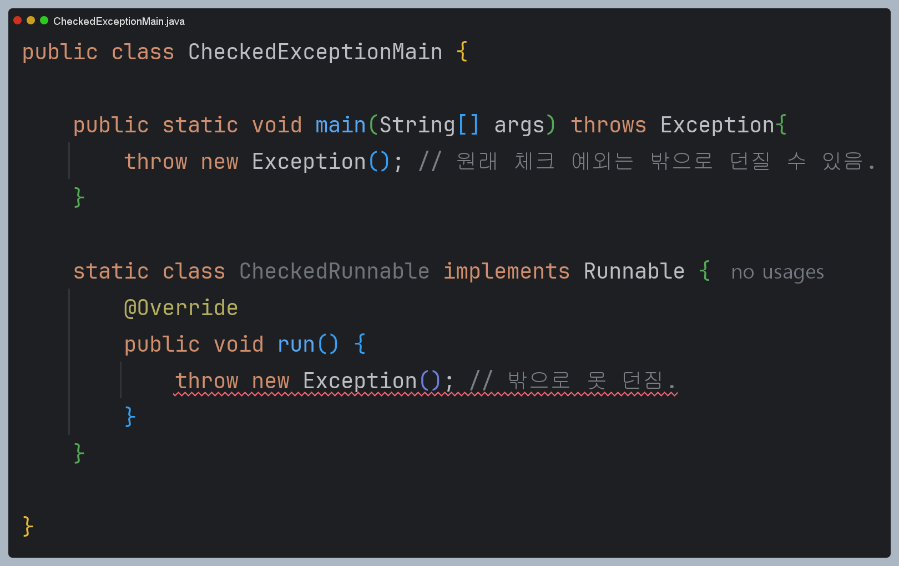

# 체크 예외 재정의

계속 Runnable의 run을 구현할 때, 체크 예외를 내부적으로 처리해야하는 불편함이 존재한다.



- 자바의 문법적으로 허용하지 않는 것이다.

## Runnable

Runnable 인터페이스는 다음과 같이 정의되어 있다.

```java
@FunctionalInterface
public interface Runnable {
    /**
     * Runs this operation.
     */
    void run();
}
```

## 자바에서 Override를 할 때, 예외 관련 규칙

### 체크예외
- 부모 메서드가 체크 예외를 던지지 않는 경우, 재정의된 자식 메서드도 체크 예외를 던질 수 없다.
- 자식 메서드는 부모 메서드가 던질 수 있는 체크 예외의 하위 타입만 던질 수 있다.

### 언체크(런타임)예외
- 예외 처리를 강제하지 않는다.

### 자바에서 이런 제약을 두는 이유
- 자식 클래스가 더 넓은 범위의 예외를 던지지 못하게 하는 것.
- 예외의 일관성을 해치는 걸 막기위함. 부모는 InterruptedException만 던지도록 했는데 자식이 그 상위인 Exception을 던져버리면? 체크 예외를 잡거나 던져야하는 자바의 규칙에 어긋나버릴 수 있음
- 컴파일 단계에서는 부모의 InterruptedException을 처리하는 걸로 알고 있는데, 실제 실행될 때는 자식의 오버라이드 메서드에서 Exception을 던져버리면 못잡을 수 있음.

- 그렇다면 왜 run()에서 throws Exception을 해두지 않았을까?
- 스레드 내부에서 예외를 마지막으로 처리할 수 있도록 하기 위함. (예외가 일어난 스레드에서 깔끔하게 마무리할 수 있도록)
- 하기만 이런 체크 예외를 강제하는 부분은 자바 초창기이고, 최근에는 언체크(런타임) 예외를 더 선호한다.

### 반복되는 try-catch를 개선하는 방법
Thread.sleep()과 try-catch 만을 따로 빼둔 Util 클래스를 만들어서 해당 클래스를 사용.

```java
public abstract class ThreadUtils { // 정적 메서드만 사용하므로 abstract

    public static void sleep(long millis) {
        try {
            Thread.sleep(millis);
        } catch (InterruptedException e) {
            log("인터럽트 발생, " + e.getMessage());
            throw new RuntimeException(e); // 체크 예외를 런타임 에러로 바꿔서 던짐.
        }
    }
}
```


