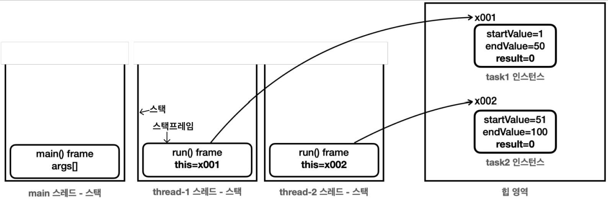
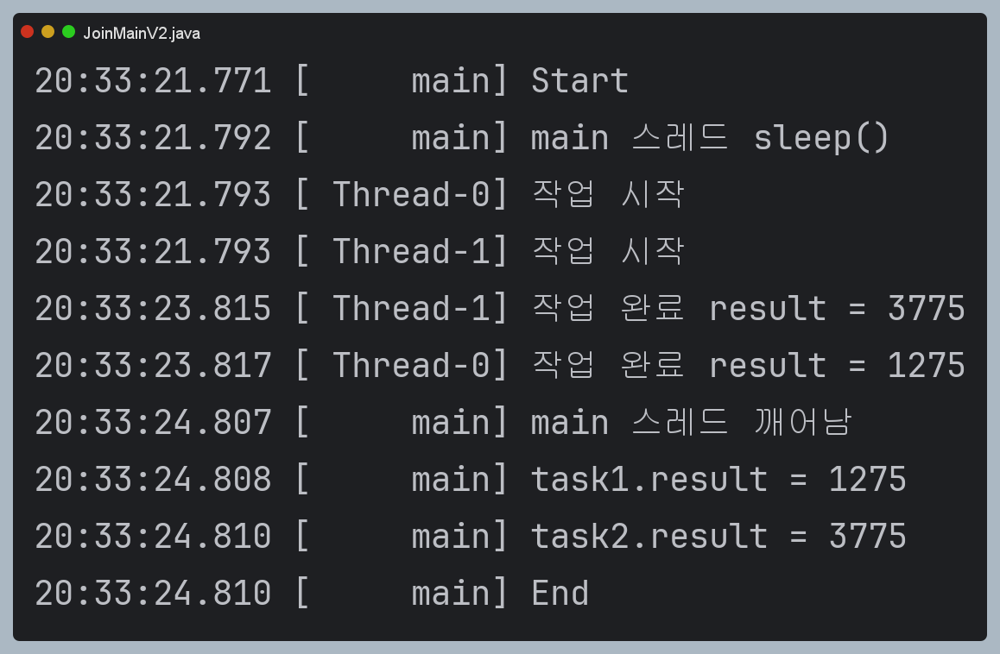
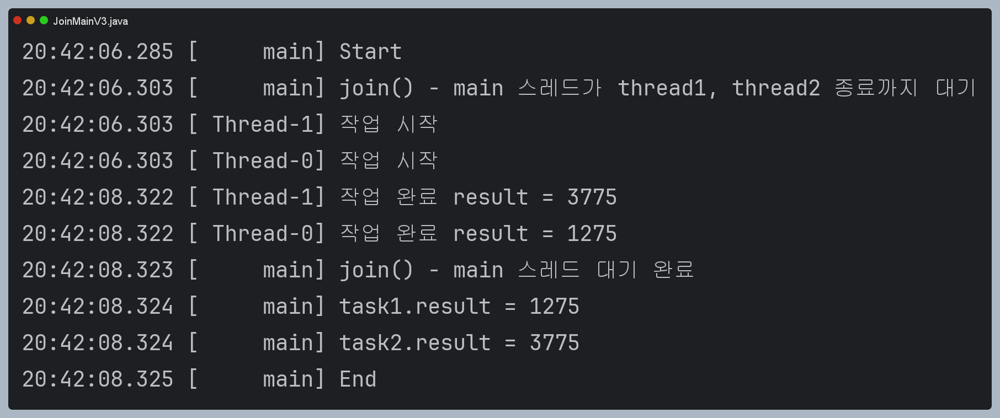
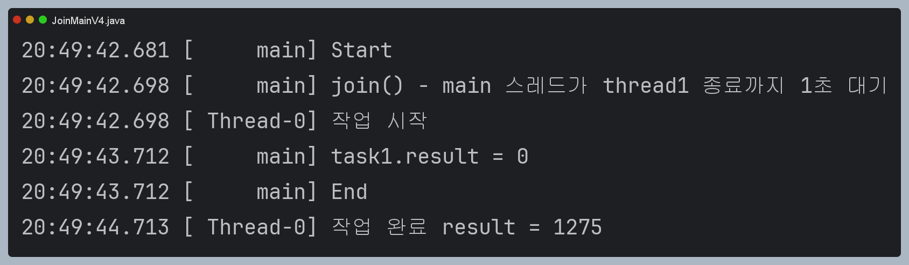

# join - 시작

### Waiting (대기 상태)
- 스레드가 다른 스레드의 특정 작업이 완료되기를 무기한 기다리는 상태이다.

### join이 필요한 상황

- 보통은 main 스레드에서 `thread1`, `thread2`를 호출한 뒤, main은 종료된다.
- 만약 main 스레드에서 `thread1`과 `thread2`의 작업의 결과가 필요하다면? 즉, `thread1`과 `2`의 작업이 선행되어야한다면?
- join을 사용할 수 없다면 다음과 같은 상황에서 task의 결과들은 모두 0이다. main에서 바로 실행되기 때문이다.

```java
public class JoinMainV1 {

    public static void main(String[] args) {
        log("Start");
        SumTask task1 = new SumTask(1, 50);
        SumTask task2 = new SumTask(51, 100);
        Thread thread1 = new Thread(task1);
        Thread thread2 = new Thread(task2);

        thread1.start();
        thread2.start();

        log("task1.result = " + task1.result);
        log("task2.result = " + task2.result);

        log("End");
    }

    static class SumTask implements Runnable {

        int startValue;
        int endValue;
        int result = 0;

        public SumTask(int startValue, int endValue) {
            this.startValue = startValue;
            this.endValue = endValue;
        }

        @Override
        public void run() {
            log("작업 시작");
            sleep(2000);
            int sum = 0;
            for (int i = startValue; i <= endValue; i++) {
                sum += i;
            }
            result = sum;
            log("작업 완료 result = " + result);
        }
    }

}
```

### How?
위 상황은 main에서 각 task1과 task2가 수행되기도 전에 바로 result를 읽어버리기 때문에 0을 읽어버린다.
어떻게 해야 task1과 task2의 계산 후의 결과를 main 스레드에서 가져올 수 있을까?

나의 생각은 다음과 같다.
1. 대충 이쯤이면 끝나겠지하고 main 스레드를 몇초간 재운다. sleep()
2. thread1과 thread2의 작업이 종료되는 걸 인지할 수 있는 메서드를 사용한다. -> `join`이겠지?


## 참고
### this의 비밀
어떤 메서드를 호출하는 것은, 정확히 특정 스레드가 어떤 메서드를 호출하는 것이다.
따라서 스레드는 메서드 호출을 관리하고자, 메서드를 기준으로 스택 프레임을 만들고, 해당 스택프레임을 스택위에 쌓아 올린다.
이때, 인스턴스의 메서드를 호출하면, 어떤 인스턴스의 메서드를 호출했는 지 구분하기 위해서, 해당 인스턴스의 참조값을 스택프레임 내부에 저장한다.
이것이 `this`이다.



위 예시에서 SumTask 객체에 정의된 run을 task1과 task2가 사용한다.
SumTask마다 사용하는 클래스 변수와 메서드를 구분하기 위해 인스턴스 참조값이 필요하며, 이것이 스택 프레임 내부에 저장된다는 뜻이다.

## sleep() 사용

예상한 대로 thread1, 2가 연산을 끝낼 때까지 main을 잠시 재워두고 실행하면 해결된다.

```java
public class JoinMainV2 {

    public static void main(String[] args) {
        log("Start");
        SumTask task1 = new SumTask(1, 50);
        SumTask task2 = new SumTask(51, 100);
        Thread thread1 = new Thread(task1);
        Thread thread2 = new Thread(task2);

        thread1.start();
        thread2.start();

        log("main 스레드 sleep()");
        sleep(3000);
        log("main 스레드 깨어남");

        log("task1.result = " + task1.result);
        log("task2.result = " + task2.result);

        log("End");
    }

    static class SumTask implements Runnable {

        int startValue;
        int endValue;
        int result = 0;

        public SumTask(int startValue, int endValue) {
            this.startValue = startValue;
            this.endValue = endValue;
        }

        @Override
        public void run() {
            log("작업 시작");
            sleep(2000);
            int sum = 0;
            for (int i = startValue; i <= endValue; i++) {
                sum += i;
            }
            result = sum;
            log("작업 완료 result = " + result);
        }
    }

}
```



그러나 이런 방법은 스레드가 대충 이쯤 끝내겠지? 하는 거라 누가봐도 비추천이다..

## join()

그렇다면 다음처럼 while문으로 계속 상태를 확인하는 코드를 main에 추가한다면?

```java
while(thread.getState != TERMINATED){
    // 스레드 상태가 종료될 떄 까지 반복    
}
// 계산 결과 출력
```

위처럼 계속되는 반복문은 CPU연산을 계속 사용하고, 작성하기도 번거롭다.
join()을 사용하면 깔끔하게 문제를 해결할 수 있다.

```java
public class JoinMainV3 {

    public static void main(String[] args) throws InterruptedException {
        log("Start");
        SumTask task1 = new SumTask(1, 50);
        SumTask task2 = new SumTask(51, 100);
        Thread thread1 = new Thread(task1);
        Thread thread2 = new Thread(task2);

        thread1.start();
        thread2.start();

        // 스레드가 종료될 때 까지 대기
        log("join() - main 스레드가 thread1, thread2 종료까지 대기");
        thread1.join(); // thread1이 종료될 때까지 대기!
        thread2.join(); // thread2가 종료될 때까지 대기!
        log("join() - main 스레드 대기 완료");

        log("task1.result = " + task1.result);
        log("task2.result = " + task2.result);

        log("End");
    }

    static class SumTask implements Runnable {

        int startValue;
        int endValue;
        int result = 0;

        public SumTask(int startValue, int endValue) {
            this.startValue = startValue;
            this.endValue = endValue;
        }

        @Override
        public void run() {
            log("작업 시작");
            sleep(2000);
            int sum = 0;
            for (int i = startValue; i <= endValue; i++) {
                sum += i;
            }
            result = sum;
            log("작업 완료 result = " + result);
        }
    }

}
```
결과



- 좀 더 정확히 알아보자면, `thread1`, `2`를 동시에 기다리는 게 아니라, 우선 `thread1`을 기다린다.
- `thread1`의 작업이 끝나고 `thread2`를 기다리는데, `thread1`과 `thread2`는 거의 동시에 끝나기 때문에 thread2.join()을 대기하지 않고 바로 종료된다.
- join()을 호출하는 스레드는 대상 스레드가 `TERMINATED`가 될 때까지 대기한다.
- join()시 main 스레드는 `WAITING` 상태가 된다.

## join() + 특정 시간만큼 대기
join()은 대상 스레드가 TERMINATED가 될 때까지 `무한정` 대기한다.
설명만 봐도 뭔가 위험하다. 개발자라면, 무한정 대기 보다는 어느정도 시간까지 대기하고 안되면 다시 깨어났으면 좋겠을 것이다.
이를 위해 `join(long ms)`를 지원한다.

```java
public class JoinMainV4 {

    public static void main(String[] args) throws InterruptedException {
        log("Start");
        SumTask task1 = new SumTask(1, 50);
        Thread thread1 = new Thread(task1);

        thread1.start();

        // 스레드가 종료될 때 까지 대기
        log("join() - main 스레드가 thread1 종료까지 1초 대기");
        thread1.join(1000);

        log("task1.result = " + task1.result);
        log("End");
    }

    static class SumTask implements Runnable {

        int startValue;
        int endValue;
        int result = 0;

        public SumTask(int startValue, int endValue) {
            this.startValue = startValue;
            this.endValue = endValue;
        }

        @Override
        public void run() {
            log("작업 시작");
            sleep(2000);
            int sum = 0;
            for (int i = startValue; i <= endValue; i++) {
                sum += i;
            }
            result = sum;
            log("작업 완료 result = " + result);
        }
    }

}
```



- thread1은 약 2초정도의 작업 시간이 걸린다.
- 따라서 main스레드가 1초정도만 `join(1000)` 대기하고 다시 작업을 수행하면(main) thread1의 작업은 끝나지 않아 `tast1.result = 0`으로 읽어진다.
- 이때 join(long ms)를 실행한 스레드는 `TIME_WAITING`상태가 된다. (`WAITING`이 아니다.)