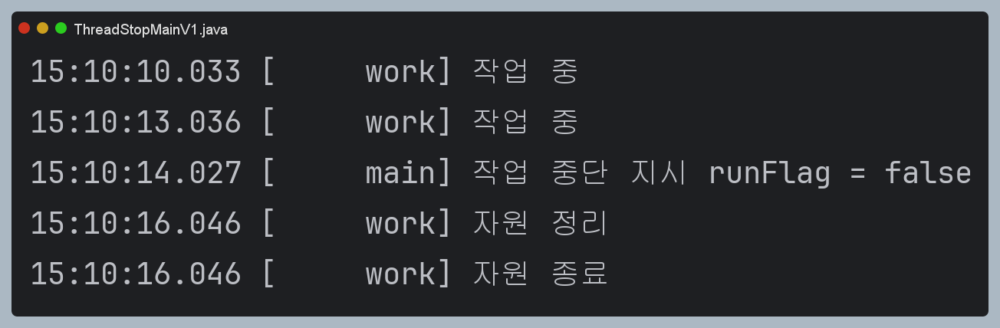
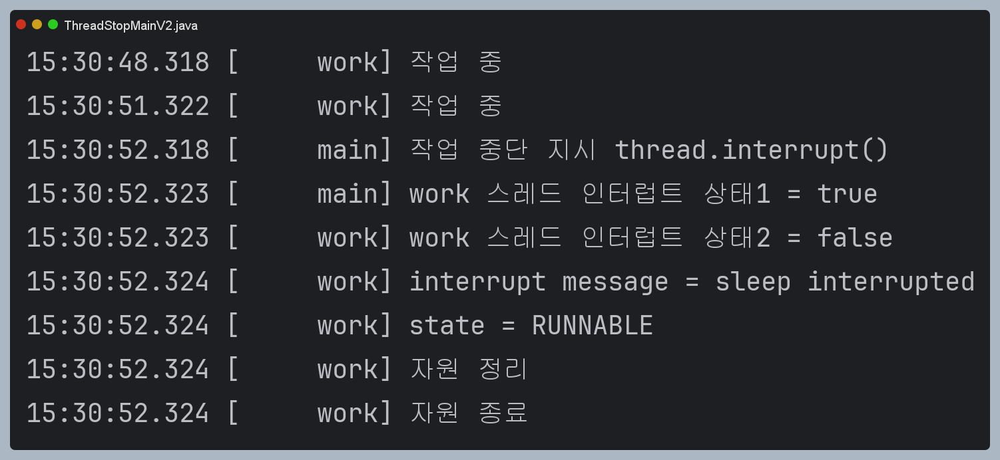
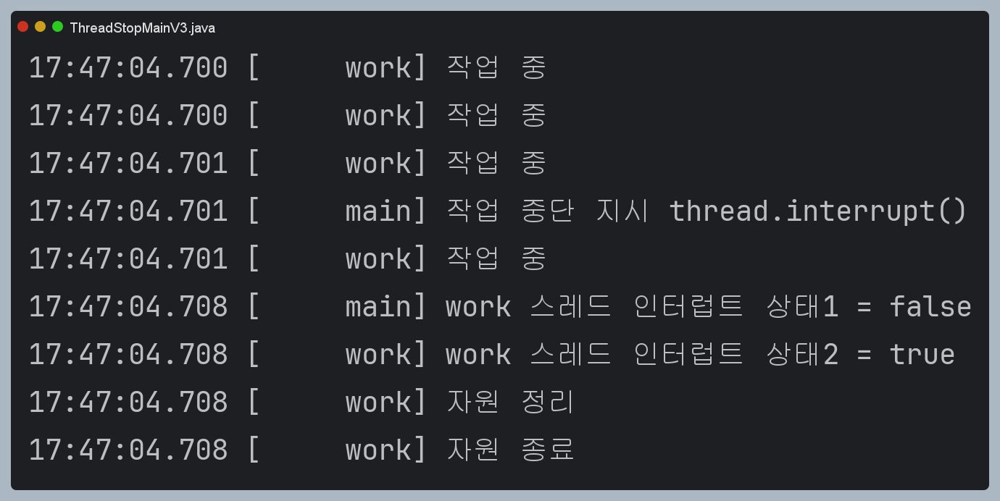
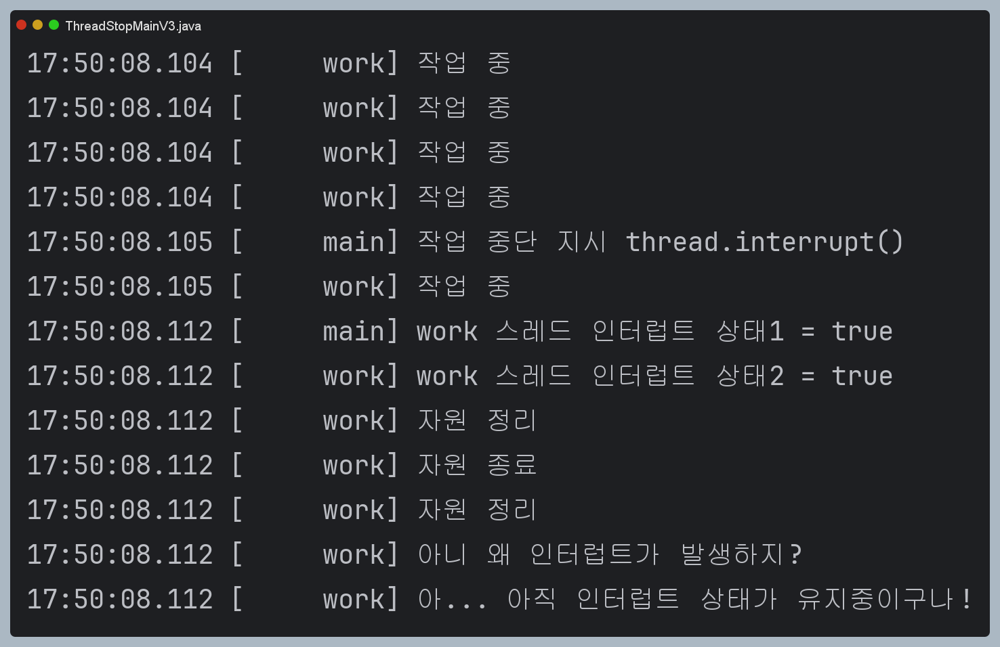
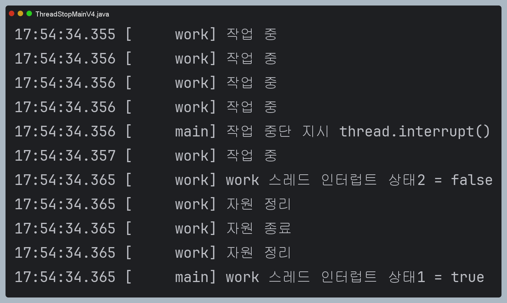

# 인터럽트

## 특정 스레드의 작업을 중단시키기

특정 스레드의 작업이 너무너무 길어지면 안된다.
특정 스레드의 작업을 중단시키기 위해서는 어떻게 해야할까?
간단히 작업 여부를 나타내는 flag 변수를 사용해볼 수 있다.

### 코드

```java
public class ThreadStopMainV1 {

    public static void main(String[] args) {
        MyTask task = new MyTask();
        Thread thread = new Thread(task, "work");
        thread.start();

        sleep(4000);
        log("작업 중단 지시 runFlag = false");
        task.runFlag = false;
    }

    static class MyTask implements Runnable {

        volatile boolean runFlag = true;

        @Override
        public void run() {
            while (runFlag) {
                log("작업 중");
                sleep(3000);
            }
            log("자원 정리");
            log("자원 종료");
        }
    }

}

```



이렇게 작업 여부를 나타내는 runFlag를 사용해, 특정 스레드의 작업을 조작할 수 있다.

### 문제점

flag변수를 사용해, 작업을 중단할 수 있게했지만, 문제가 있다.
바로 작업이 즉시 종료되지 않는 다는 점이다.

그 이유는 while문의 조건을 확인하는 과정이 3초 주기로 이루어지기 때문이다. (`sleep(3000)`)
즉, sleep()으로 work 스레드가 3초에 한 번씩 깨어나서 확인하기 때문에 발생하는 문제이다.

잠들어 있는 스레드(대기상태인 스레드)를 그 즉시 깨울 수 있다면 해결되지 않을까?   
- `1---->2---->3(상태확인->dowork)----->sleep...1----->2----->3(상태확인 stopwork)`
- `1---->2--(어떤 방법으로 깨움)->stopwork`

## 인터럽트

인터럽트를 사용하면, `WAITING`, `TIMED_WAITING` 같은 대기 상태의 스레드를 직접 깨워서, 작동하는 `RUNNABLE` 상태로 만들 수 있다.

### 코드

```java
public class ThreadStopMainV2 {

    public static void main(String[] args) {
        MyTask task = new MyTask();
        Thread thread = new Thread(task, "work");
        thread.start();

        sleep(4000);
        log("작업 중단 지시 thread.interrupt()");
        thread.interrupt();
        log("work 스레드 인터럽트 상태1 = " + thread.isInterrupted());
    }

    static class MyTask implements Runnable {
        
        @Override
        public void run() {
            try {
                while (true) {
                    log("작업 중");
                    Thread.sleep(3000);
                }
            } catch (InterruptedException e) {
                log("work 스레드 인터럽트 상태2 = " + Thread.currentThread().isInterrupted());
                log("interrupt message = " + e.getMessage());
                log("state = " + Thread.currentThread().getState());
            }

            log("자원 정리");
            log("자원 종료");
        }
    }

}
```



```java
        thread.interrupt();
        log("work 스레드 인터럽트 상태1 = " + thread.isInterrupted());
```

인터럽트를 걸고 바로 isInterrupted()를 확인하면 true가 나온다. 즉, 인터럽트가 걸렸다는 뜻이다. (너 깨어나야 해! 라고 알리는 것이 인터럽트 true)   
그리고 인터럽트를 걸어서, 타겟 스레드가 깨어나면 인터럽트 상태는 false가 된다. (`RUNNABLE` 상태가 되기 때문)
- 인터럽트가 발생하면, 인터럽트를 받은 스레드는 대기상태에서 깨어나 RUNNABLE 상태가 됨.
- 이때, InterruptedException이 발생해 catch로 잡아 정상적인 흐름으로 변경하면 된다.
- interrupt()를 호출했다고 해서 즉각 InterruptedException이 발생하는 건 아니다. 오직 sleep()처럼 InterruptedException을 던지는 메서드를 호출하거나 호출 중일 때 예외가 발생한다.

### 정리
- thread.interrupt()를 사용하면 해당 스레드는 인터럽트 상태가 된다.
- 이때, 해당 스레드가 일반적인 코드를 수행하더라도 InterruptedException을 발생시키지 않으므로 정상 수행된다.
- 그러다가 sleep() 같이 InterruptedException을 발생시키는 상황을 만나게 되면, 예외가 터지면서 인터럽트 상태가 풀려 `RUNNABLE` 상태가 된다.
- 그래서 인터럽트를 사용하면 대기중인 스레드를 바로 깨워서 실행 가능한 상태로 바꿀 수 있다는 것이다.


## 아쉬운 점
인터럽트 사용방법을 알아봤다.
아직 한가지 아쉬운 점이 존재하는데, 바로 while문의 조건문이다. 

### 기존 
```java
while(true){ // 인터럽트 상태여도, InterruptedException 발생 X
    log("작업 중");
    Thread.sleep(3000); // 여기서 InterruptedException가 발생
}
```

해당 스레드가 인터럽트 상태여도 while의 조건문은 그냥 코드가 실행되고, 실제 Thread.sleep(3000) 부분에서 인터럽트 예외가 발생한다. (=인터럽트 발생)
따라서 while 조건문에 인터럽트 상태 체크를 대신 사용하는 게 좋을 것이다.

### 개선 
```java
while(인터럽트_상태_확인){ // 여기서 인터럽트 체크
    log("작업 중");
    Thread.sleep(300); // 인터럽트 상태인 경우 InterruptedException 발생
}

```

그리고 어차피 조건문에서 인터럽트 상태를 확인하기 때문에, 인터럽트 발생 유무를 확인하기 위해서 굳이 Thread.sleep()을 사용할 필요도 없다.
- 추가로 궁금한건 CPU 사용률 관점에서 봤을 때는 sleep()을 사용하는 게 낫지않나...? 싶네


```java
while(인터럽트_상태_확인){ // 여기서 인터럽트 체크
    log("작업 중");
}
```

따라서 위와 같이 코드를 작성하고 실습해보자.

### 코드 실습

```java
public class ThreadStopMainV3 {

    public static void main(String[] args) {
        MyTask task = new MyTask();
        Thread thread = new Thread(task, "work");
        thread.start();

        sleep(100);
        log("작업 중단 지시 thread.interrupt()");
        thread.interrupt();
        log("work 스레드 인터럽트 상태1 = " + thread.isInterrupted());
    }

    static class MyTask implements Runnable {

        @Override
        public void run() {
            while (!Thread.currentThread().isInterrupted()) {
                log("작업 중");
            }
            log("work 스레드 인터럽트 상태2 = " + Thread.currentThread().isInterrupted());
            log("자원 정리");
            log("자원 종료");
        }
    }

}

```



위와 같이 인터럽트 상태를 계속 확인해, while 조건문이 true여서 `작업 중`이 뜨고,
인터럽트가 발생하면 바로 작업이 중단되는 걸 확인할 수 있다.

### 아쉬운 점
위 코드에서 아쉬운 점은
while(`인터럽트 상태 확인`) 은 말 그래도 해당 스레드가 인터럽트 상태인 지 아닌 지 `확인`할 뿐이라는 것이다.
즉, 인터럽트 인지 상태만 확인하지, 인터럽트 상태를 정상 상태로 변경하지 않는다.

따라서 위 코드에 추가적으로 Thread.sleep()을 사용하는 코드가 사용되게 된다면?
인터럽트 상태는 그대로 유지되어, 해당 코드 라인에서 InterruptedException이 발생할 것이다.

### 엣지 케이스

```java
public class ThreadStopMainV3 {

    public static void main(String[] args) {
        MyTask task = new MyTask();
        Thread thread = new Thread(task, "work");
        thread.start();

        sleep(100);
        log("작업 중단 지시 thread.interrupt()");
        thread.interrupt();
        log("work 스레드 인터럽트 상태1 = " + thread.isInterrupted());
    }

    static class MyTask implements Runnable {

        @Override
        public void run() {
            while (!Thread.currentThread().isInterrupted()) {
                log("작업 중");
            }
            log("work 스레드 인터럽트 상태2 = " + Thread.currentThread().isInterrupted());
            log("자원 정리");
            log("자원 종료");

            // 인터럽트 상태가 유지되어 발생할 수 있는 엣지케이스 
            try {
                log("자원 정리");
                Thread.sleep(3000);
            } catch (InterruptedException e) {
                log("아니 왜 인터럽트가 발생하지?");
                log("아... 아직 인터럽트 상태가 유지중이구나!");
            }
        }
    }

}
```



위와 같이, while문을 빠져나오더라도, 인터럽트 상태는 계속 유지되어, InterrupetdException을 발생시키는 코드를 만났을 때 인터럽트가 발생하게된다.


### 해결

단순히 인터럽트 상태를 확인하기 위해서는 `isInterrupted()`를 사용하면 된다.
하지만, 인터럽트 상태인 경우, true를 반환하고 다시 정상상태로 변환하기 위해서는 `interrupted()`를 사용하면된다.

```java
public class ThreadStopMainV4 {

    public static void main(String[] args) {
        // 위와 동일
    }

    static class MyTask implements Runnable {

        @Override
        public void run() {
            while (!Thread.interrupted()) { // 변경
                log("작업 중");
            }
            log("work 스레드 인터럽트 상태2 = " + Thread.currentThread().isInterrupted());
            log("자원 정리");
            log("자원 종료");

            try {
                log("자원 정리");
                Thread.sleep(3000);
            } catch (InterruptedException e) {
                log("아니 왜 인터럽트가 발생하지?");
                log("아... 아직 인터럽트 상태가 유지중이구나!");
            }
        }
    }

}
```



이렇게 interrupted()를 사용하면 상태까지 변경해주면서 Thread.sleep()을 만나더라도 InterruptedException이 발생하지 않는다.

### Code 봐보기

interrupted()는 어떻게 구현되어 있을 지 확인해보자.
추측 상, 인터럽트 상태가 true이면, 
1. 인터럽트 상태를 false로 변환
2. true 반환. (변환하기 전 인터럽트가 true인 상태를 반환)
으로 추측한다. 

```java
public static boolean interrupted() {
    return currentThread().getAndClearInterrupt();
}

boolean getAndClearInterrupt() {
    boolean oldValue = interrupted;
    // We may have been interrupted the moment after we read the field,
    // so only clear the field if we saw that it was set and will return
    // true; otherwise we could lose an interrupt.
    if (oldValue) {
        interrupted = false;
        clearInterruptEvent(); // Native Code
    }
    return oldValue;
}
```

실제로 인터럽트 상태가 true이면, `interrupted = false`를 수행한 다음 oldValue라는 tmp 개념을 사용해, true를 반환하도록 한다.
참고로 clearInterruptedEvent()는 native code이다.
실제 자바 메모리에서 인터럽트 상태를 단순히, 저장하기 위한 변수는 interrupted에 저장하고,
실제, 재우고 깨우는 OS적인 로직은 C++로 작성된 Native Code에서 수행된다.
clearInterruptedEvent는 인터럽트 이벤트를 초기화하는 역할을 수행한다. 