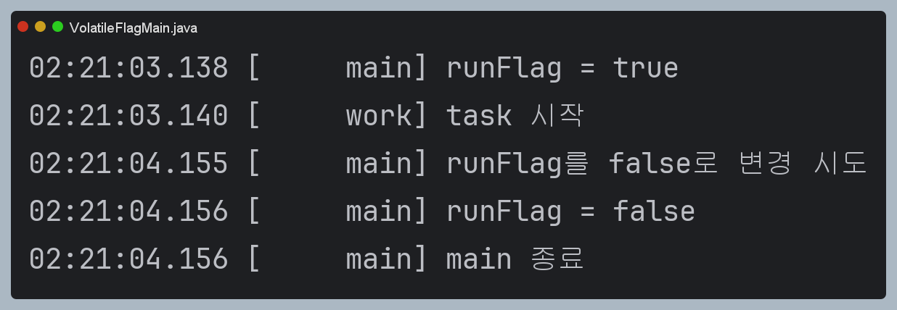
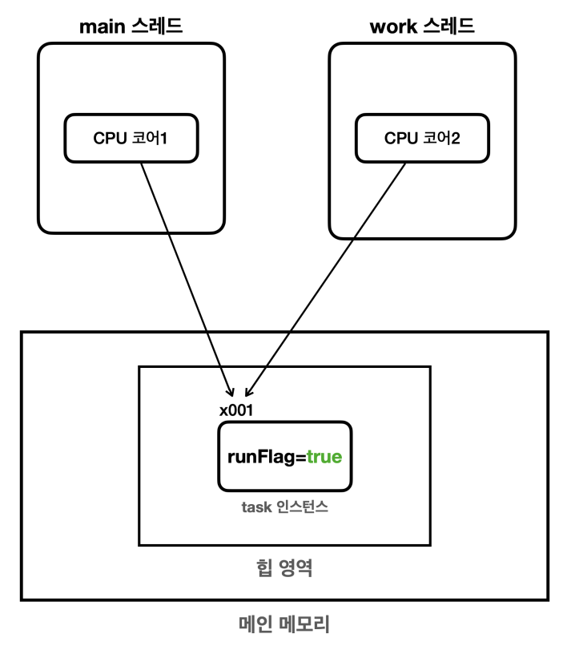
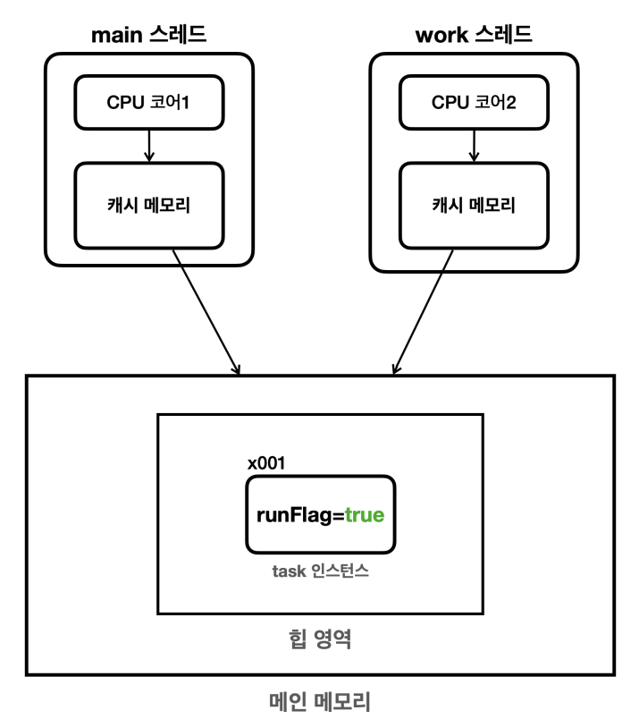
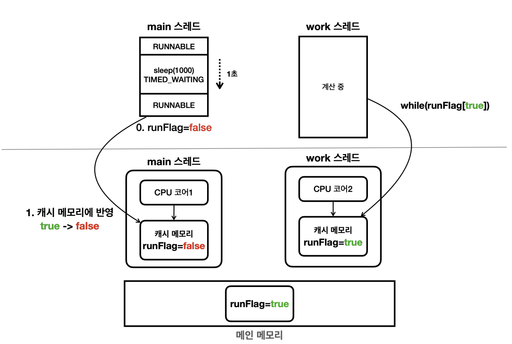
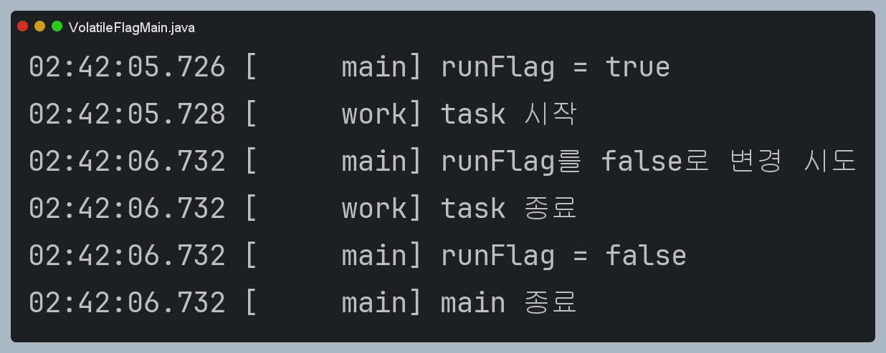
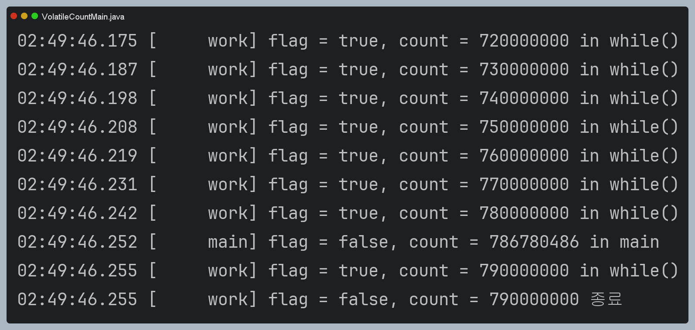
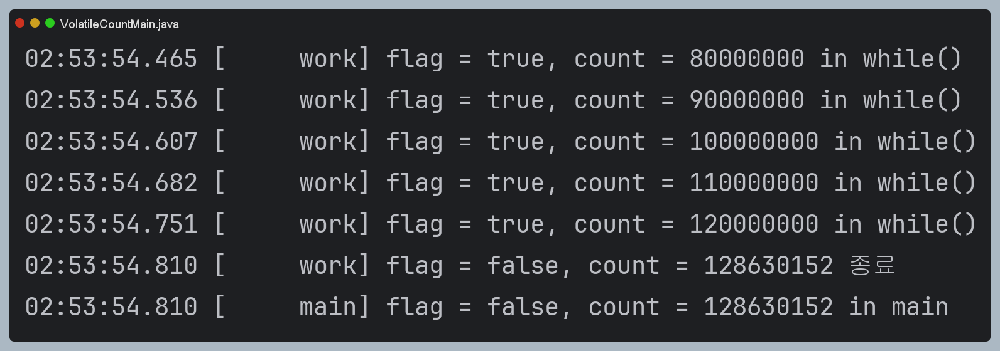

# volatile 

지금까지 예제에서 사용해온 `volatile`은 뭘까?
한번 알아보자.

간단히 volatile을 사용하지 않았을 때와 사용 했을 때를 비교해보자.

## volatile 사용 하지 않는 경우

```java
package thread.control.volatile1;

import static util.MyLogger.log;
import static util.ThreadUtils.sleep;

public class VolatileFlagMain {

    public static void main(String[] args) {
        MyTask task = new MyTask();
        Thread thread = new Thread(task, "work");
        log("runFlag = " + task.runFlag);
        thread.start();

        sleep(1000);
        log("runFlag를 false로 변경 시도");
        task.runFlag = false;
        log("runFlag = " + task.runFlag);
        log("main 종료");
    }

    static class MyTask implements Runnable {

        boolean runFlag = true;
//        volatile boolean runFlag = true;

        @Override
        public void run() {
            log("task 시작");
            while (runFlag) {
                // runFlag가 false로 변하면 탈출
            }
            log("task 종료");
        }
    }

}

```



- 설명이 없다면 무슨 문제인지 모를것이다.
- 바로 자바 프로그램이 종료가 되지 않는다.
- 즉, runFlag는 false로 바뀌었지만, MyTask가 while문에서 빠져나오지 못하고 있다. (직접 실행해보면 된다!)
- 우리의 의도대로라면 runFlag가 false니까 while문을 잘 탈출하겠지?? -> 실상은 그렇지 않다..


## 메모리 가시성 문제

우리의 의도가 전제한 메모리 구조는 다음과 같다.

### 우리가 생각한 메모리 구조



- 위와 같이, main과 work 스레드는 각각 CPU 코어에 할당된다.
- 이때, 메인 메모리에 있는 runFlag를 읽어온다는 가정으로 생각하면 우리의 의도대로 동작해야한다.
- 그러나 실제 메인 메모리는 다음과 같이 동작한다.

### 실제 메인 메모리 구조



CPU는 처리 성능을 개선하기 위해서 Cache Memory를 사용한다. (ex L1, L2, L3)

- CPU 입장에서는 메인메모리에 접근하기에는 거리도 멀고 상대적으로 속도도 느리다. (기본적인 캐시의 도입 배경)
- 또한 매우매우 빠른 CPU 연산 속도를 따라가려면 CPU 가까이 있는 메모리가 필요한데 이 메모리가 `캐시 메모리`이다.

따라서 다음과 같이 동작하므로 문제가 발생한다.

### 원인 분석



- main 스레드에서 runFlag의 값을 false로 바꾸더라도, main 스레드가 사용하는 CPU와 연결된 캐시메모리의 값을 바꾸는 것이다.
- 즉, 캐시 메모리의 runFlag 값만 변한다. 이 변화가 메인 메모리에 즉시 반영되지 않는다.
- 당연히 work 스레드의 캐시 메모리에도 반영되지 않는다.

### 이렇게 한다면?

- 그렇다면 캐시 메모리의 변화를 메인 메모리에 적용되는 건 언제일까?
> -> 정답은 알 수 없다.

- 변화가 메인메모리에 반영되면 모든게 해결될까?
> -> 아니다. 메인메모리에 반영된 변화가 work 스레드의 캐시메모리에도 반영 되어야한다.
> -> 이러한 반영 역시 언제 적용될 지 알 수 없다.
> -> 주로 컨텍스트 스위칭이 될 때, 캐시 메모리도 함께 갱신되나, 이 부분도 환경에 따라 다르다.

### 메모리 가시성 (memory visibility)

이처럼 멀티 스레드 환경에서 한 스레드가 변경한 값이, 다른 스레드에 언제 보이는가??를 다룬 문제가 `메모리 가시성`이다.

### 해결 방안

그렇다면 근본적인 해결 방법은?
변수를 읽어올 때, 언제나 메인 메모리에서 가져오고 변화하도록 하는 것이다. (대신 성능은 조금 포기..)
이를 도와주는 것이 `volatile`이다.

## volatile 사용 후

이제, 캐시 메모리에 접근하지 않고 메인 메모리에 직접 접근할 수 있도록 `volatile`을 사용해보고 결과를 확인해보자.

```java
package thread.control.volatile1;

import static util.MyLogger.log;
import static util.ThreadUtils.sleep;

public class VolatileFlagMain {

    public static void main(String[] args) {
        MyTask task = new MyTask();
        Thread thread = new Thread(task, "work");
        log("runFlag = " + task.runFlag);
        thread.start();

        sleep(1000);
        log("runFlag를 false로 변경 시도");
        task.runFlag = false;
        log("runFlag = " + task.runFlag);
        log("main 종료");
    }

    static class MyTask implements Runnable {

//        boolean runFlag = true;
        volatile boolean runFlag = true;

        @Override
        public void run() {
            log("task 시작");
            while (runFlag) {
                // runFlag가 false로 변하면 탈출
            }
            log("task 종료");
        }
    }

}

```



이전에 보지 못했던, `task 종료` 문구를 확인할 수 있다. 


## volatile count 예제 (volatile X)

다음 예제를 본다면, 실제로 flag가 false로 되는 순간의 `count`   
그리고 실제 멈추는 시점의 `count`를 대략적으로 비교할 수 있다.

```java
public class VolatileCountMain {

    public static void main(String[] args) {
        MyTask myTask = new MyTask();
        Thread thread = new Thread(myTask, "work");

        thread.start();
        sleep(1000);

        myTask.flag = false;
        log("flag = " + myTask.flag + ", count = " + myTask.count + " in main");
    }

    static class MyTask implements Runnable {

        boolean flag = true;
        long count;

//        volatile boolean flag = true;
//        volatile long count;

        @Override
        public void run() {
            while (flag) {
                count++;
                if (count % 100_00_000 == 0) {
                    log("flag = " + flag + ", count = " + count + " in while()");
                }
            }
            log("flag = " + flag + ", count = " + count + " 종료");
        }
    }

}

```



위 결과를 해석해보자.
- main 스레드가 flag를 false로 변경하는 시점에 count값은 `786780486`이다.
- work 스레드가 이후에 flag를 확인하지만 아직 flag = true이다. (캐시 메모리에서 읽으므로)
- work 스레드는 이후에 count 값이 `790000000`이 되었을 때, flag가 false로 변한 걸 확인할 수 있다.

## 다시 한 번 메모리 가시성

- 캐시 메모리를 메인 메모리에 반영하거나, 메인 메모리의 변경 내역을 캐시 메모리에 반영하는 건 언제 발생할까?
- 이 부분은 CPU 설계 방식과 실행 환경에 따라 다르다. `즉시 반영`, `몇 밀리초 후 반영`, `몇 초 후 반영`, `평생 반영X` 등등 다양하다.
- 주로 컨텍스트 스위칭이 될 때, 함께 갱신되긴 하지만, 환경에 따라 달라지긴 한다.
- Thread.sleep(), 콘솔 출력(sout) 등을 할 때, 스레드가 잠시 쉬는데, 이럴 때 컨텍스트 스위칭이 되면서 주로 갱신된다. 하지만 갱신을 보장하지 않는다.

## volatile count 예제 (volatile O)

volatile을 사용한다면? (코드 생략)



다음과 같이 정확하게 종료되는 걸 확인할 수 있다.
대신, volatile을 사용하지 않았을 때, 1초에 약 7.9억까지 계산했지만,
메인메모리에 직접 접근하는 volatile을 사용하니 1초에 약 1.2억까지 계산하게 됐다. (성능 감소)