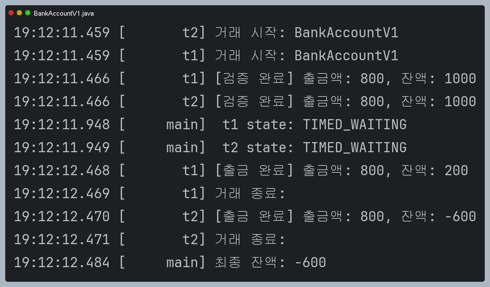
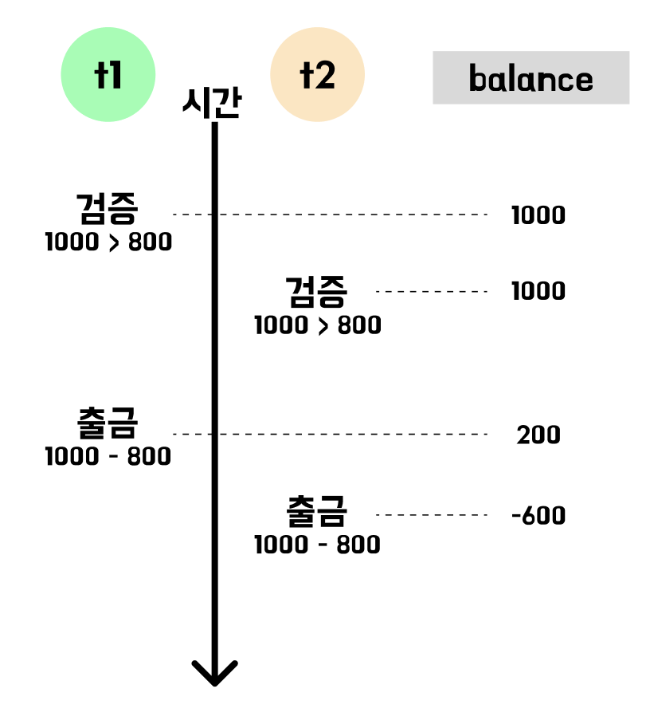
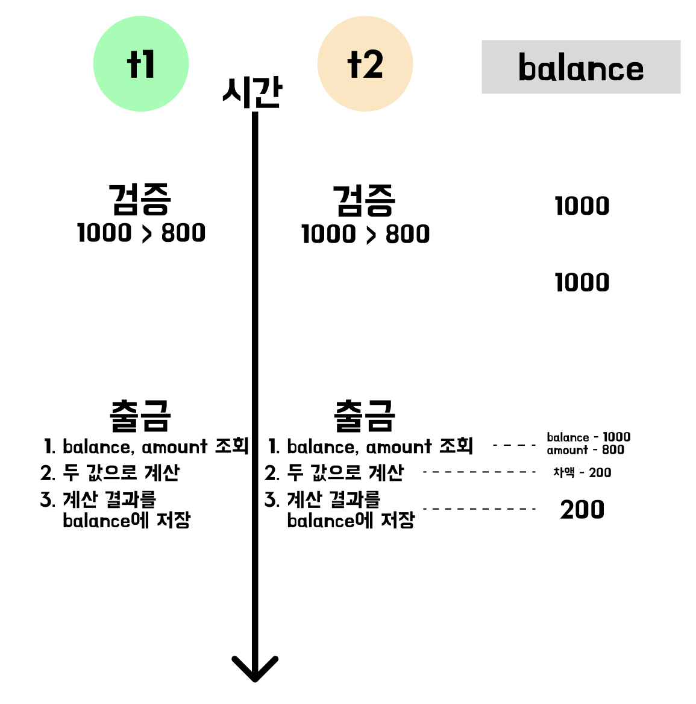
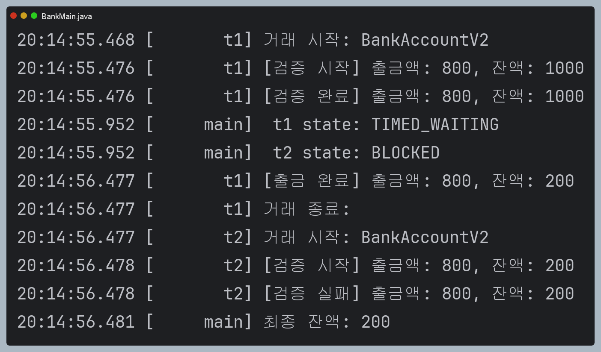
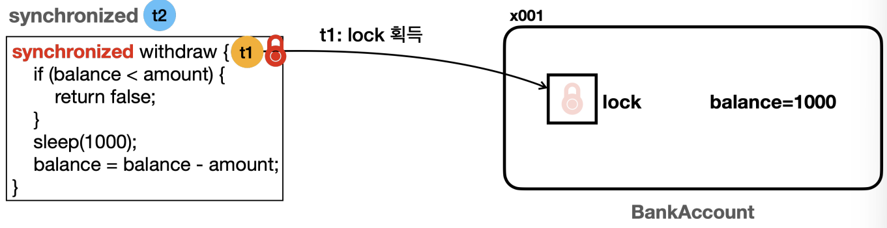
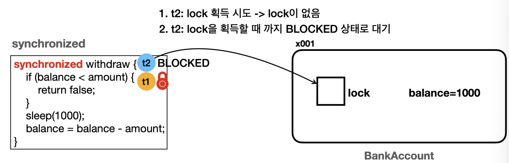
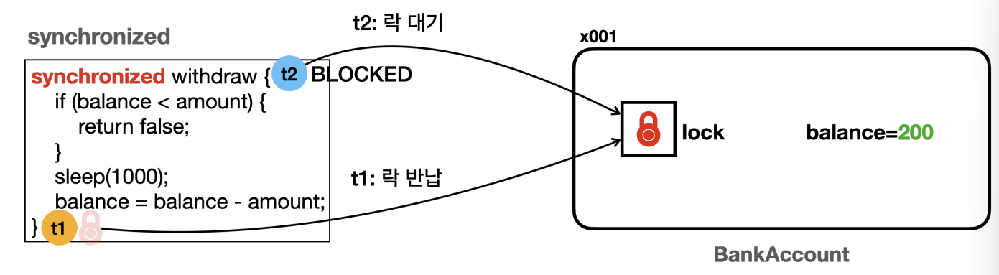
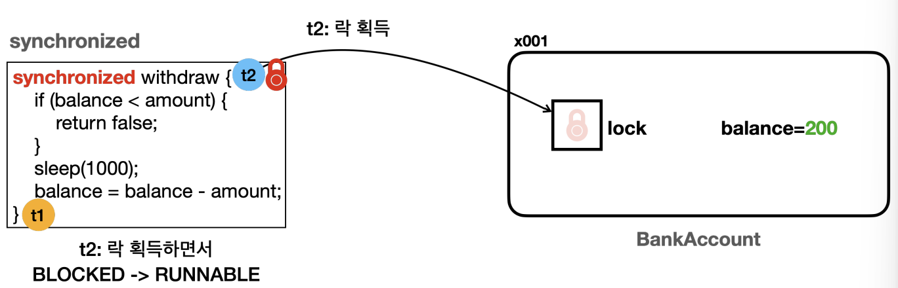

# 출금예제 - 시작

멀티스레드를 사용할 때, 가장 주의해야할 점은, 같은 자원에 여러 스레드가 동시에 접근할 때, 발생하는 `동시성 문제`이다.   
참고로 여러 스레드가 접근하는 자원을 `공유 자원`이라고 한다.   
멀티 스레드를 사용할 때는, 이런 공유자원에 대한 접근을 적절하게 동기화(synchronization)해서 동시성 문제가 발생하지 않게 방지하는 게 중요함.

## 예제

### BankAccount Interface

여러 버전의 구현체를 만들어 실습하고자, 인터페이스로 추상화 

```java
public interface BankAccount {

    boolean withdraw(int amount);

    int getBalance();

}
```

### BankAccount Version 1

출금액이 보유액보다 큰 지, 검증한 뒤, 실제 출금과정을 거치도록 한다.

```java
package thread.sync;

import java.util.Scanner;

import static util.MyLogger.log;
import static util.ThreadUtils.sleep;

public class BankAccountV1 implements BankAccount{

    private int balance;

    public BankAccountV1(int initialBalance) {
        this.balance = initialBalance;
    }

    @Override
    public boolean withdraw(int amount) {
        log("거래 시작: " + getClass().getSimpleName()); // 실행되는 클래스의 인스턴스명 출력
        if (balance < amount) {
            log("[검증 실패] 출금액: " + amount + ", 잔액: " + balance);
            return false;
        }

        log("[검증 완료] 출금액: " + amount + ", 잔액: " + balance);
        sleep(1000);
        balance = balance - amount;
        log("[출금 완료] 출금액: " + amount + ", 잔액: " + balance);

        log("거래 종료: ");
        return false;
    }

    @Override
    public int getBalance() {
        return balance;
    }

}

```

### WithDrawTask

Thread 생성자에 넣어주기 위한 Task

```java
public class WithdrawTask implements Runnable{

    private BankAccount account;
    private int amount;

    public WithdrawTask(BankAccount account, int amount) {
        this.account = account;
        this.amount = amount;
    }

    @Override
    public void run() {
        account.withdraw(amount);
    }

}
```

### Main

t1과 t2의 작업이 종료되길 기다리고, 결과를 출력하기 위해 `join()` 사용

```java
package thread.sync;

import static util.MyLogger.log;
import static util.ThreadUtils.sleep;

public class BankMain {

    public static void main(String[] args) throws InterruptedException {
        BankAccount account = new BankAccountV1(1000);
        Thread t1 = new Thread(new WithdrawTask(account, 800), "t1");
        Thread t2 = new Thread(new WithdrawTask(account, 800), "t2");

        t1.start();
        t2.start();

        sleep(500); // 검증 완료까지 잠시 대기
        log(" t1 state: " + t1.getState());
        log(" t2 state: " + t2.getState());

        t1.join();
        t2.join();

        log("최종 잔액: " + account.getBalance());
    }

}

```

### Version 1 실행 결과




내부 동작에 따라, 두 가지의 의도하지 않은 결과를 얻을 수 있다.

1. 출금 과정을 두번 수행하고 잔금이 200원이 됨.
2. 출금 과정을 두번 수행하고 잔금이 -600원이 됨.

우선 출금 과정이 두번 수행되었다는 것 자체가 일어나서는 안되는 일이다.   
또한, 두번 수행되었음에도 결과는 200원이 되어 데이터 정합성이 깨져버린 모습과 보유액이 마이너스가 되어버린 결과를 얻었다.


## 원인

### 실행 과정 회고

어떤 것이 문제였을까?   
실행 과정을 알아보자.



위와 같이, `t1`, `t2`가 실행될 때, t1의 검증 후 출금 과정에 `t2의 검증`이 개입되어버리거나
t1와 t2가 동시에 수행되어버리면, 



다음과 같이 balance의 결과가 200이 나온다.

### 원인

위에서 살짝 언급했지만, 큰 문제는 공유 자원의 개입이라고 생각한다.   
공유 자원 balance를 사용할 때, `검증`, `출금` 등의 여러 과정을 거쳤고, 이때, 여러 스레드가 중간 중간에 개입하기 때문이다.   
이 개입을 고려하지 않은 것은 결국 "스레드가 검증단계에서 확인한 잔액과 출금단계에서 계산을 끝마칠때 까지의 잔액은 1000원으로 같아야함"을 보장할 수 없다.   

```text
출금(){
    1. 검증 단계: 잔액 확인
    2. 출금 단계: 잔액 감소
        2-1. 잔액, 출금액 확인
        2-2. 계산
        2-3. 계산 결과를 잔액에 반영
}
```

### 임계영역

로직에 다른 스레드의 개입이 없도록, 한 번에 한 스레드만 전체 로직을 수행할 수 있게 한다면 문제는 해결될 것이다.      
물론 해당 로직은 한 스레드만 수행할 수 있기에, 성능에 문제가 있을 것이다.   

여기서 말한 로직은 다른 말로 `임계영역`이라 할 수 있다.   
여러 스레드가 동시에 접근하면 데이터 불일치나 예상치 못한 동작이 발생할 수 있다.   
이렇게 위험하고 중요한 코드 부분을 `임계영역`이라고 한다.   
다른 말로는 여러 스레드가 동시에 접근해서는 안되는 `공유 자원`에 접근하거나 수정하는 부분을 의미한다.

우리가 살펴본 `출금()` 로직이 바로 임계 영역이다.

<hr>

## synchronized

자바는 임계영역을 보호할 수 있는 방법으로 `synchronized`를 제공한다.   
사용 방법도 단순하다.   

## BankAccount Version 2

단순히 메서드에 `synchronized`만 추가하면 된다.

```java
package thread.sync;

import static util.MyLogger.log;
import static util.ThreadUtils.sleep;

public class BankAccountV2 implements BankAccount{

    private int balance;

    public BankAccountV2(int initialBalance) {
        this.balance = initialBalance;
    }

    // synchronized 추가
    @Override
    public synchronized boolean withdraw(int amount) {
        log("거래 시작: " + getClass().getSimpleName()); // 실행되는 클래스의 인스턴스명 출력

        // ==임계 영역 시작==
        log("[검증 시작] 출금액: " + amount + ", 잔액: " + balance);
        if (balance < amount) {
            log("[검증 실패] 출금액: " + amount + ", 잔액: " + balance);
            return false;
        }

        log("[검증 완료] 출금액: " + amount + ", 잔액: " + balance);
        sleep(1000);
        balance = balance - amount;
        log("[출금 완료] 출금액: " + amount + ", 잔액: " + balance);

        log("거래 종료: ");
        return false;
    }

    @Override
    public synchronized int getBalance() {
        return balance;
    }

}

```

### 결과



다음과 같이 한 스레드는 sleep(1000)으로 인해, `TIMED_WAITING` 상태가 되고 한 스레드는 `BLOCKED` 상태가 됐다.   
또한,t1의 출금 과정이 종료된 뒤, t2 스레드의 거래가 시작되었으며, 결과적으로 검증단계에서 실패됐다.   
어떤 원리일까

## synchronized 분석

모든 객체(인스턴스)는 내부에 자신만의 락(lock, monitor lock)을 가지고 있다.

우선 t1이 먼저 실행되어 BankAccountV2의 락을 획득하게 된다. 
- t1이 withdraw() 먼저 호출.
- synchronized 메서드를 호출하기 위해서는 해당 인스턴스의 락이 필요.
- t1은 BankAccountV2의 락을 획득하게 된다. 



- t1은 BankAccountV2의 락을 획득했으므로, withdraw() 메서드에 진입한다.
- 스데르 t2도 withdraw()를 호출하지만, 락 획득에 실패한다. (t1이 선수침)
- 따라서 t2는 락을 획득할 때 까지 BLOCKED 상태로 대기한다.
  - t2 스레드의 상태는 `RUNNABLE` -> `BLOCKED`로 변하고, 락을 획득할 때까지 무한정 대기한다.
  - `BLOCKED` 상태가 되면 CPU 실행 스케줄링에 들어가지 않는다. (CPU 사용률에 부담은 없음)



t1이 전체적인 로직을 수행한 뒤 BankAccount 인스턴스의 락을 반환하면,   
락을 대기하고 있는 t2가 락을 획득하게된다.





그리고 t2는 락을 획득하면서 `BLOCKED` 상태에서 `RUNNABLE` 상태가 되며, 로직을 수행하낟.   
이 다음은, 검증 로직에 실패하면서 종료된다.

### 참고 1

이때, BankAccount의 락을 획득하기 위해 많은 스레드가 대기 중일 때, 어떤순서로 락을 획득하는 지는 자바 표준에 정의되어있지 않다.   
따라서 순서를 보장하지 않고 환경에 따라 순서가 달라질 수 있다.   

### 참고 2

`volatile`를 사용하지 않고, `synchronized` 안에서 접근하는 변수의 메모리 가시성 문제는 해결된다.   
이는 happens-before 관계가 발생(성립)하기 때문이다. (ch05 참고)   
정확히는 모니터 락 규칙이다. 

- [관련 문서1](https://medium.com/@gathilaharism/happens-before-rules-specified-in-java-memory-model-734ab400170f)
- [관련 문서2](https://mangkyu.tistory.com/415)

한 스레드에서 `synchronized`를 종료한 후, 그 모니터 락을 얻는 모든 스레드는 해당 블록 내의 모든 작업을 볼 수 있다.   
또한 `synchronized(lock) {...}` 블록 내에서의 작업은 블록을 나가는 시점에 happens-before 관계가 성립한다.   

- 추가로 `ReentrantLock`와 같이 락을 사용하는 경우에도 happens-before 관계가 성립한다.

<hr>


## synchronized 코드 블럭

앞서 잠깐 말했는데, synchronized는 한 번에 하나의 스레드만 실행할 수 있도록 하기에, 성능이 떨어질 수 있다.   
때문에, synchronized로 임계영역을 보호하는 구간을 잘 설정해서 임계영역인 부분과 그렇지 않은 부분을 잘 구분해야한다.   

이때, 전체적으로 적용되는 synchronized 대신 `synchronized 코드 블럭`을 통해 구체적으로 명시해줄 수 있다.

### 코드

```java
package thread.sync;

import static util.MyLogger.log;
import static util.ThreadUtils.sleep;

public class BankAccountV3 implements BankAccount{

    private int balance;

    public BankAccountV3(int initialBalance) {
        this.balance = initialBalance;
    }

    @Override
    public boolean withdraw(int amount) {
        log("거래 시작: " + getClass().getSimpleName()); // 실행되는 클래스의 인스턴스명 출력

        synchronized (this) { // 나의 인스턴스에서 락을 얻어오겠다는 의미.
            // ==임계 영역 시작==
            log("[검증 시작] 출금액: " + amount + ", 잔액: " + balance);
            if (balance < amount) {
                log("[검증 실패] 출금액: " + amount + ", 잔액: " + balance);
                return false;
            }

            log("[검증 완료] 출금액: " + amount + ", 잔액: " + balance);
            sleep(1000);
            balance = balance - amount;
            log("[출금 완료] 출금액: " + amount + ", 잔액: " + balance);
        }

        log("거래 종료: ");
        return false;
    }

    @Override
    public synchronized int getBalance() {
        return balance;
    }

}

```

```java
        synchronized (this) { // 나의 인스턴스에서 락을 얻어오겠다는 의미.
            // ==임계 영역 시작==
            log("[검증 시작] 출금액: " + amount + ", 잔액: " + balance);
            if (balance < amount) {
                log("[검증 실패] 출금액: " + amount + ", 잔액: " + balance);
                return false;
            }

            log("[검증 완료] 출금액: " + amount + ", 잔액: " + balance);
            sleep(1000);
            balance = balance - amount;
            log("[출금 완료] 출금액: " + amount + ", 잔액: " + balance);
        }
```

이렇게 구체적으로 임계영역인 부분과 그렇지 않은 부분을 구분하여, 성능 향상에 조금이나라 도움이 될 수 있다.   
이때, BankAccountV3의 인스턴스 락을 사용하므로, 이 인스턴스의 참조인 this를 넣어주면 된다.   

