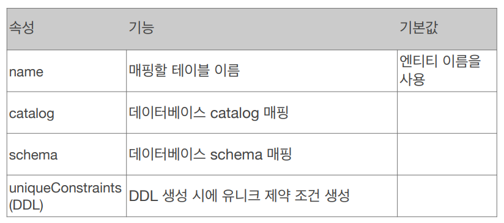

# 객체와 테이블 매핑

## @Entity

@Entity가 붙은 클래스는 JPA가 관리하는 엔티티이다.   
JPA를 사용해서 테이블과 매핑할 클래스는 @Entity가 필수이다.

### 주의 사항
- 기본 생성자가 필수이다. (파라미터가 없는 public or protected 생성자)
- final 클래스, enum, interface, inner 클래스에는 사용하지 않는다.
- 저장할 필드에 final 사용 X

### 속성
속성: name   

- JPA에서 사용할 엔티티 이름을 지정(테이블 명과 다름)
- 기본값: 클래스 이름을 그대로 사용한다.
- 같은 클래스 이름이 없으면 가급적 기본값을 사용합시다!


```java
@Entity(name="Member")
public class Member { /*생략*/}
```

## @Table
@Table은 엔티티와 매핑할 테이블을 지정한다.


