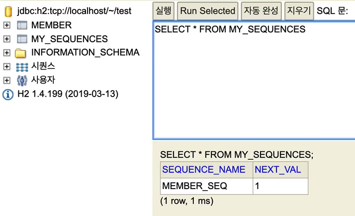

# 기본 키 매핑

## @Id, @GeneratedValue

```java
@Id @GeneratedValue(strategy = GenerationType.AUTO)
private Long id;

```

## 기본 키 매핑 방법
- 직접 할당: @Id만 사용 + 해당 필드는 Null이면 X
- 자동 생성: @Id + @GeneratedValue
  - IDENTITY: 데이터베이스에 기본 키 위임 (MYSQL 전용)
  - SEQUENCE: 데이터베이스 시퀀스 오브젝트 사용 (ORACLE)
    - @SequenceGenerator 필요
  - TABLE: 키 생성 용 테이블을 사용한다. 모든 DB에서 사용할 수 있다.
    - @TableGenerator 필요
  - AUTO: 방언에 따라 자동으로 지정해준다. (기본 값)


## IDENTITY 전략 
### IDENTITY 전략
IDENTITY는 기본 키 생성을 DB에 위임하는 전략이다.   
주로 MySQL, PostgreSQL, SQL Server, DB2에서 사용한다.   
ex) DB가 기본 키를 자동으로 생성해주는 MySQL의 AUTO_INCREAMENT 기능   

예시 MySQL 방언


### IDENTITY 전략과 최적화
IDENTITY 전략은 데이터를 DB에 INSERT한 후에 ID(기본 키 값)을 알 수 있따.   
따라서 엔티티에 식별자 값을 할당하려면 JPA는 추가로 DB를 조회하는 SQL을 실행 해야한다.   

JDBC3에 추가된 Statement.getGeneratedKeys()를 사용하면 데이터를 저장하면서 동시에 생성된 기본 키 값도 얻어올 수 있어서, DB와 의 통신을 한번으로 줄일 수 있다.   

### IDENETITY 전략 주의점
엔티티가 영속 상태가 되려면 식별자가 반드시 필요하다.   
그런데 IDENTITY 식별자 생성 전략은 엔티티를 DB에 저장해야 식별자를 구할 수 있다.   

따라서 em.persist()를 호출하는 즉시 INSERT SQL이 DB에 전달된다. 따라서 이 전략은 트래잭션을 지원하는 쓰기 지연이 동작하지 않는다.   

## SEQUENCE 전략
### SEQUENCE 전략
DB 시퀀스는 유일한 값을 순서대로 생성하는 특별한 DB 오브젝트이다.   
SEQUENCE 전략은 이 시퀀스를 사용해서 기본 키를 생성한다.   

이 전략은 시퀀스를 지원하는 오라클, PostgreSQL, DB2, H2 데이터베이스에서 사용할 수 있다.   

```java
// 시퀀스 매핑 코드
@Entity
@SequenceGenerator(
        name = "BOARD_SEQ_GENERATOR",
        sequenceName = "BOARD_SEQ", // 매핑할 데이터베이스 시퀀스 이름
        initialValue =1, allcationSize = 1 )
public class Board{
    
    @Id
    @GeneratedValue(strategy = GeneratedValue.SEQUENCE,
                        generator = "BOARD_SEQ_GENERATOR")
    private Long id;
}


```
@SequenceGenerator를 사용해서 BOARD_SEQ_GENERATOR라는 시퀀스 생성기를 등록했다.   
그리고 sequenceName 속성의 이름으로 BOARD_SEQ를 지정했는데 JPA는 이 시퀀스 생성기를 실제 DB의 BOARD_SEQ 시퀀스와 매핑한다.  

### SEQUENCE 전략 과정 및 최적화

em.persist(member) 할 때, PK값이 없고 SEQUENCE 전략인 걸 알아챘다면, DB로 부터 시퀀스 값을 가져와 member의 PK에 대입해준다.(SQL 쿼리는 나가지 않음)   
따라서 SQL을 한 번에 모아서 보낼 수 있다.   

하지만 이 과정도 PK값에 해당하는 시퀀스 값을 조회해야하는(next call) 성능 이슈가 있다.   
이를 해결하기 위해서 allocationSize를 설정한다. (defalut: allocationSize=50)    
즉, 메모리에 미리 1~50까지의 값을 미리 할당해놓고 DB가 아닌 메모리로 부터 시퀀스 값을 호출해 성능을 보완한다.   


## TABLE 전략
TABLE 전략은 키 생성 전용 테이블을 하나 만들고 여기에 이름과 값으로 사용할 컬럼을 만들어 DB 시퀀스를 흉내내는 전략이다.   
이 전략은 테이블을 사용하므로 모든 DB에 적용할 수 있다.   

하지만 DB에서 관례로 쓰는 것을 사용하자. (권장)   


```java
@Entity 
@TableGenerator( 
 name = "MEMBER_SEQ_GENERATOR", 
 table = "MY_SEQUENCES", 
 pkColumnValue = “MEMBER_SEQ", allocationSize = 1) 
public class Member{
      @Id
      @GeneratedValue(strategy = GenerationType.TABLE,
              generator = "MEMBER_SEQ_GENERATOR")
      private Long id;
}

```

실행 결과 (SQL)
```sql
create table MY_SEQUENCES ( 
 sequence_name varchar(255) not null, 
 next_val bigint, 
 primary key ( sequence_name ) 
)
```

실행 결과 (DB확인)


### TABLE 전략 최적화
시퀀스에서 사용하는 최적화 방식과 같다.   

여러 서버를 두는 경우에도 상관 없이 사용할 수 있다.   


## 권장하는 식별자 전략
기본 키 제약 조건에 대해 생각해볼 필요가 있음   

기본 키 제약 조건: Null X, 유일해야한다. 변하면 안된다.
   - 먼 미래까지 이 조건을 만족하는 자연키를 찾기 힘들다 -> 대리키를 사용하자.
   - 예를 들어 주민등록번호도 기본 키로 적절치 X -> 정부 정책으로 주민등록번호를 저장하는 건 법적인 문제

따라서 대리키(대체키 ex. 랜덤 값...)를 사용하자.   

권장: Long 형 + 대체 키 + 키 생성 전략 사용   


