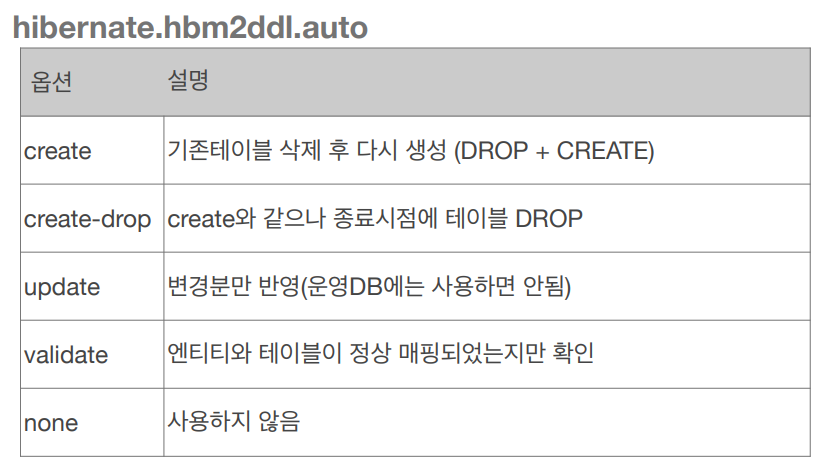
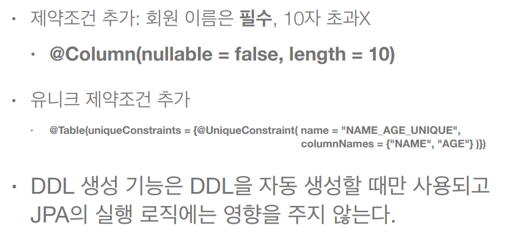

# 데이터베이스 스키마 자동 생성

- DDL을 어플리케이션 실행 시점에 자동 생성
- 테이블 중심 -> 객체 중심
- DB 방언을 활용해서 DB에 맞는 적절한 DDL 생성
- 이렇게 생성된 DDL은 개발 장비에서만 사용하자
- 생성된 DDL은 운영서버에서는 사용하지 않거나, 적절히 다듬은 후 사용하자

## 속성

hibernate.hbm2ddl.auto

- update 사용시 컬럼이 사라지는 변경의 경우는 반영되지 않는다.   

## DB 스키마 자동 생성 주의

**운영 장비에는 절대 create, create-drop, update를 사용하면 안된다.**

- 개발 초기 단계는 create 또는 update   
- 테스트 서버는 update 또는 validate
- 스테이징과 운영 서버는 validate or none

## DDL 생성 기능

