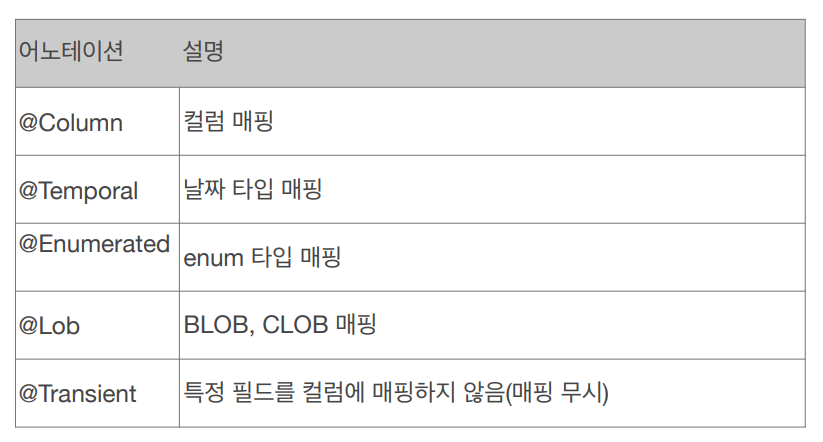
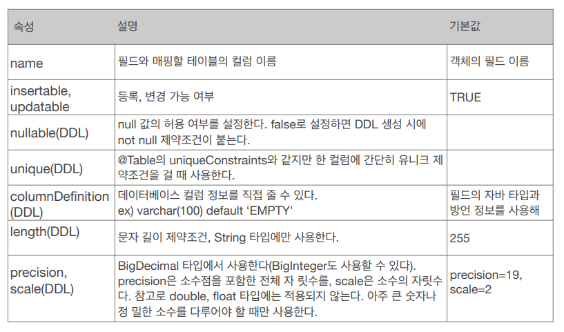

# 필드와 컬럼 매핑

```java
package hellojpa; 
import javax.persistence.*; 
import java.time.LocalDate; 
import java.time.LocalDateTime; 
import java.util.Date; 
@Entity 
public class Member { 
 @Id 
 private Long id; 
 @Column(name = "name") 
 private String username; 
 private Integer age; 
 @Enumerated(EnumType.STRING) 
 private RoleType roleType; 
 @Temporal(TemporalType.TIMESTAMP) 
 private Date createdDate; 
 @Temporal(TemporalType.TIMESTAMP) 
 private Date lastModifiedDate; 
 @Lob 
 private String description; 
 //Getter, Setter… 
} 
```

## 매핑 어노테이션


## @Column 어노테이션 속성

