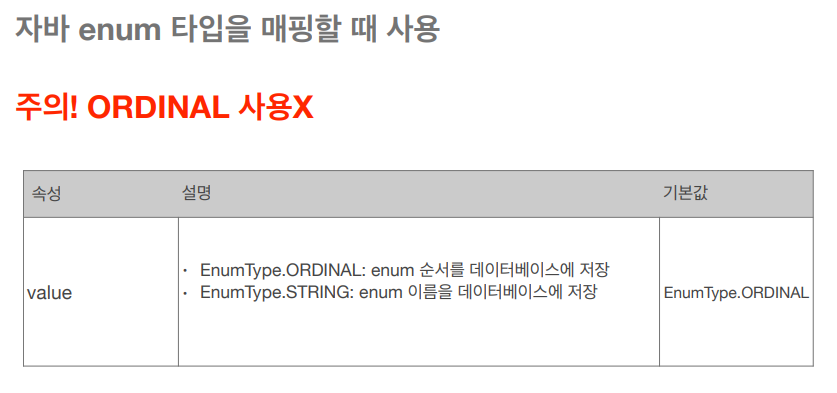
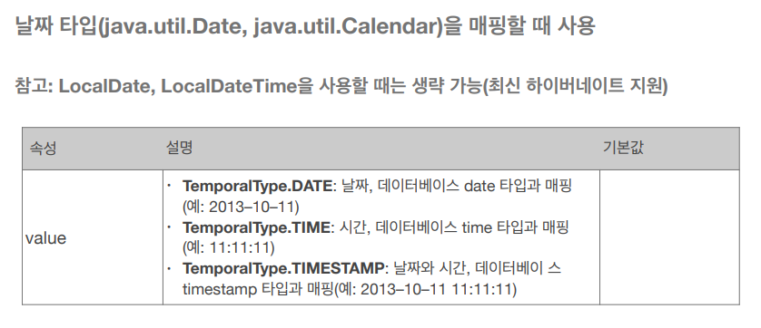
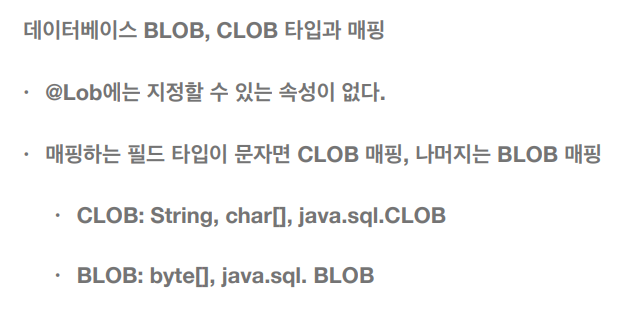

# 필드와 컬럼 매핑

```java
package hellojpa; 
import javax.persistence.*; 
import java.time.LocalDate; 
import java.time.LocalDateTime; 
import java.util.Date; 
@Entity 
public class Member { 
 @Id 
 private Long id; 
 @Column(name = "name") 
 private String username; 
 private Integer age; 
 @Enumerated(EnumType.STRING) 
 private RoleType roleType; 
 @Temporal(TemporalType.TIMESTAMP) 
 private Date createdDate; 
 @Temporal(TemporalType.TIMESTAMP) 
 private Date lastModifiedDate; 
 @Lob 
 private String description; 
 //Getter, Setter… 
} 
```

## 매핑 어노테이션


## @Column 어노테이션 속성


## @Enumerated



ORIGINAL을 사용하면 Enum에 적힌 순서대로 DB에 저장된다. (ex 0, 1, 2)   
STRING을 사용하면 Enum에 적힌 이름으로 DB에 저장된다. (ex USER, ADMIN)   

운영 상에서는 무조건 STRING을 써야한다.   
ORIGINAL을 사용했을 때 Enum에 새로운 타입이 추가되면 순서가 꼬이게 되는 문제가 발생한다.   

- ex) Enum에 USER, MANAGER 만 있던 상황
- DB에 USER는 0, MANAGER는 1로 DB에 저장됨
- 이 후 Enum에 ADMIN, USER, MANAGER 로 수정된 상황
- ADMIN이 0, USER는 1, MANAGER는 2로 DB에 저장된다
- 문제는 Enum에 ADMIN이 추가 되기전 DB에 저장된 0과 ADMIN이 추가된 후 DB에 저장된 0의 구분이 불가능하다.

## @Temporal



과거 버전을 사용하면 사용하지만, LocalDateTime, LocalDate를 사용하면 생략해도 된다.   

## @Lob
Large Object의 줄임말이다.   
필드에 특정 문자열 길이를 지정하지 않으면 varchar(255) - MySQL기준   
으로 저장된다.   

BLOB(Binary Large Object)는 큰 크기의 이진 데이터를,   
CLOB(Character Large Object)는 큰 크기의 문자 데이터를 저장하는데 사용한다.

