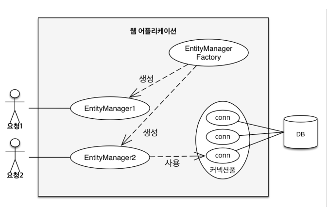

# 영속성 컨테스트1

JPA 에서 가장 중요한 2가지
- 객체와 관계형 데이터베이스 매핑하기 (ORM)
- 영속성 컨텍스트

이번에는 영속성 컨텍스트에 대해 알아본다.

## 엔티티 매니저 팩토리와 엔티티 매니저

EntityManagerFactory를 통해서 고객의 요청이 올 때 마다 EntityManager를 생성한다.   
그렇게 생성된 EntitiyManager는 내부적으로 Database 커넥션을 사용해서 DB를 사용한다.




## 영속성 컨텍스트

영속성 컨텍스트는 "엔티티를 영구 저장하는 환경"이다.   
엔티티 매니저를 통해서 영속성 컨텍스트에 접근한다.   
```java
em.persist(entity); // entity를 영속성 컨텍스트에 저장한다는 뜻 (DB가 아니라)
```


## 엔티티의 생명주기


### 비영속
영속성 컨텍스트와 전혀 관계가 없는 새로운 상태


```java
//객체를 생성만 한 상태(비영속)
Member member = new Member();
member.setId("member1");
member.setUsername("회원1");

```


### 영속
영속성 컨텍스트에 의해 관리되는 상태

- 참고: em.persist가 아니라 트랜잭션이 커밋될 때 DB에 저장된다.


```java
//객체를 생성만 한 상태(비영속)
Member member = new Member();
member.setId("member1");
member.setUsername("회원1");

EntityManager em = emf.createEntityManager();
em.getTransaction().begin();

// 객체를 영속성 컨텍스트에 저장한 상태 (영속)
em.persist(member);

```


### 준영속
영속성 컨텍스트에 저장되었다가 분리된 상태

```java
em.detach(member);
```

### 삭제
삭제된 상태

```java
em.remove(member);
```


