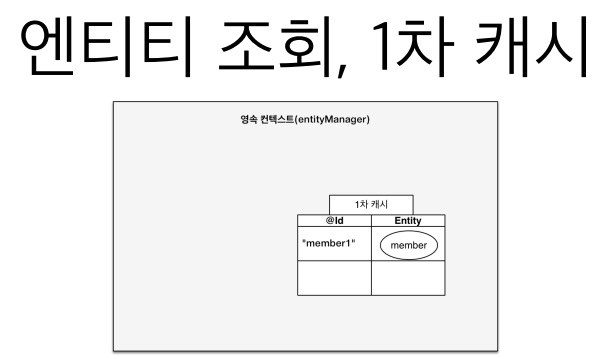
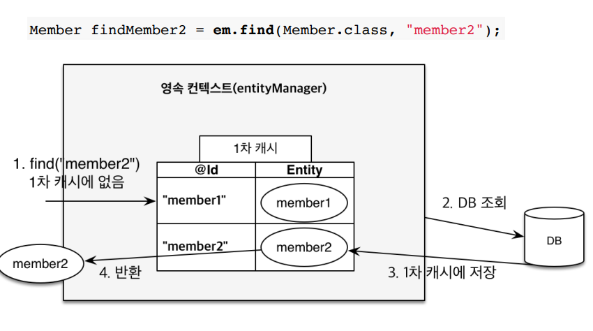
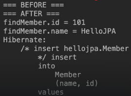
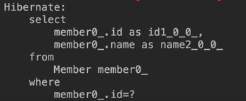
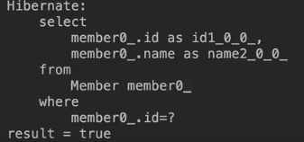
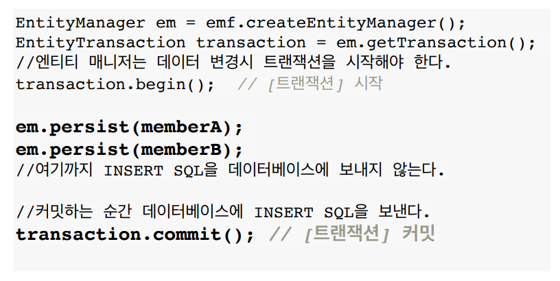
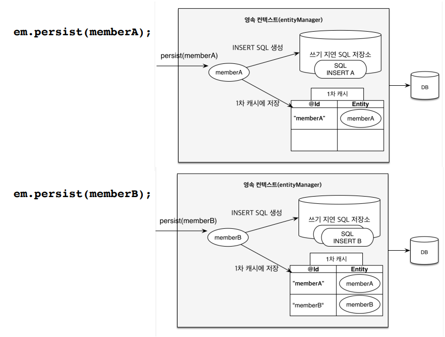
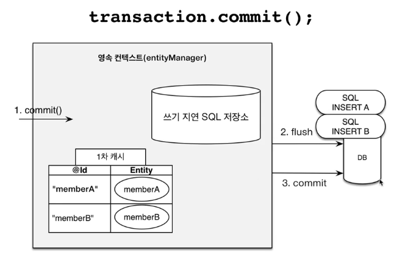
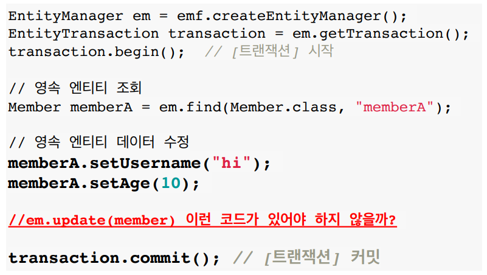
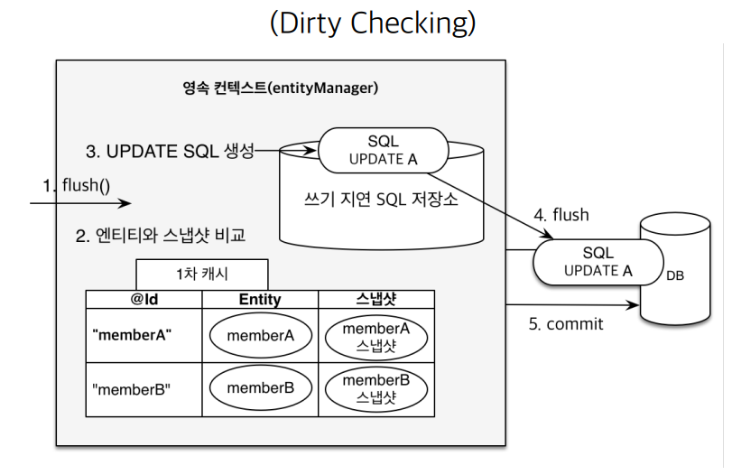

# 영속성 컨텍스트 2

## 엔티티 조회, 1차 캐시


조회하는 엔티티가 1차 캐시에 존재하는 경우 DB에 접근하지 않고, 1차 캐시에 있는 엔티티를 반환한다.

## 데이터베이스 조회


1차 캐시에 엔티티가 존재하지 않으면, DB를 조회하여 1차 캐시에 저장하고 이를 반환한다.   

## 실습으로 알아보기 1

### 코드 1
```java
Member member = new Member();
member.setId(101L);
member.setName("HelloJPA");

System.out.println("=== BEFORE ===");
em.persist(member);
System.out.println("=== AFTER ===");

Member findMember = em.find(Member.class, 101L);

System.out.println("findMember.id =" + findMember.getId());
System.out.println("findMember.name =" + findMember.getName());

```

### 실행 결과 1


### 이유 1

em.find(Member.class, 101L); 에서 SELECT SQL 쿼리가 나가지 않는다.   
이유는 em.persist(member)를 코드로 인해서 ID가 101L인 member 엔티티는 1차 캐시에 존재하기 때문이다.   
따라서 1차 캐시에 조회하고자 하는 엔티티가 있으므로 DB를 조회하지 않고 바로 반환한다.   

## 실습으로 알아보기 2

### 코드 2
```java
Member findMember1 = em.find(Member.class, 101L);
Member findMember2 = em.find(Member.class, 101L);


```

### 실행 결과 2


### 이유 2
SELECT SQL이 한번만 수행된다.   
이유는 처음 DB를 조회하고 난 뒤 엔티티가 1차 캐시에 저장되어 반환되기 때문에   
2번째 em.find()메서드가 실행될 때는 1차 캐시에서 엔티티를 반환하므로 SQL이 날라가지 않는다. 


## 영속 엔티티의 동일성 보장

1차 캐시로 반복 가능한 읽기를 통해서 1차 캐시에 있는 엔티티를 반환하므로   
같은 트랜잭션 안에서 조회한 엔티티에 대해서 동일성을 보장해준다.

### 코드 1
```java
Member findMember1 = em.find(Member.class, 101L);
Member findMember2 = em.find(Member.class, 101L);

System.out.println("result =" + (findMember1 == findMember2));

```

### 실행 결과 1



## 엔티티 등록
### 트랜잭션을 지원하는 쓰기 지연



쓰기 지연 SQL 저장소 과정


트랜잭션 커밋


em.persist(memberA); 가 수행되면, 1차 캐시에 memberA가 저장되고 INSERT 쿼리가 쓰기 지연 SQL 저장소에 저장된다.   
em.persist(memberB); 가 수행되면, 1차 캐시에 memberB가 저장되고 INSERT 쿼리가 쓰기 지연 SQL 저장소에 저장된다.   
이때 까지는 DB에 쿼리가 날라가지 않은 상태이다.   

트랜잭션이 커밋되면 쓰기 지연 SQL 저장소에 저장된 SQL 쿼리를 DB에 전달한다. (이과정을 flush)   
전달 후 SQL의 결과를 DB에 반영한다 (commit)

## 엔티티 수정, 변경 감지




1. 트랜잭션을 커밋하면 엔티티 매니저 내부에서 먼저 플러시(flush)가 호출된다.
2. 엔티티와 스냅샷을 비교해서 변경된 엔티티를 찾는다.
   * 스냅샷: 엔티티가 1차 캐시에 들어온 시점의 상태를 사진을 찍어둔 것.
3. 변경된 엔티티가 있으면 수정 쿼리를 생성해서 쓰기 지연 SQL 저장소로 보낸다.
4. 쓰기지연 저장소의 SQL을 데이터베이스에 보낸다.
5. 데이터베이스 트랜잭션을 커밋한다.

### 변경 감지 전략 (모든 필드 업데이트)
변경 감지가 이루어지면 엔티티의 모든 필드를 업데이트한다.   
이렇게 모든 필드를 업데이트하여 SQL 쿼리를 만들면 DB에 보내는 데이터 전송량이 증가하는 단점이 있다.   
하지만 다음 두가지 장점이 있다.   

1. 모든 필드를 사용해 업데이트하면 수정 쿼리가 항상 같다. 따라서 애플리케이션 로딩 시정메 수정 쿼리를 미리 생성해두고 재사용 할 수 있다.   
2. 데이터베이스에 동일한 쿼리를 보내면 데이터베이스는 이전에 하 번 파싱된 쿼리를 재사용 할 수 있다.

### Dynamic Update
필드가 많거나 저장되는 내용이 너무 크면 수정된 데이터만 사용해 동적으로 UPDATE SQL을 생성하는 전략이 있다.   
이 전략이 Dynamic Update이다.

```java
@Entity
@org.hibernate.annotations.DynamicUpdate
@Table(name = "Member")
public class Member {...}
```

위와 같이 org.hibernate.annotations.DynamicUpdate를 사용하면 수정된 데이터만 사용해 동적으로 UPDATE SQL을 생성한다.

- 데이터를 저장할 때 데이터가 존재하는(null이 아닌) 필드만으로 INSTERT SQL을 동적으로 생성하는 @DynamicInsert도 있다.